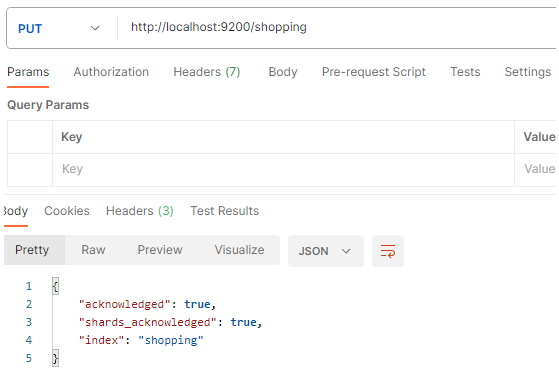
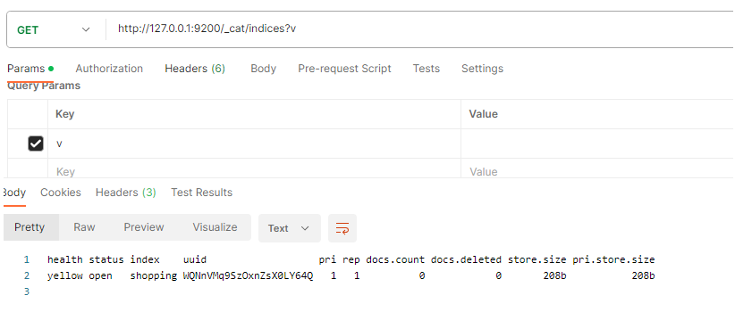
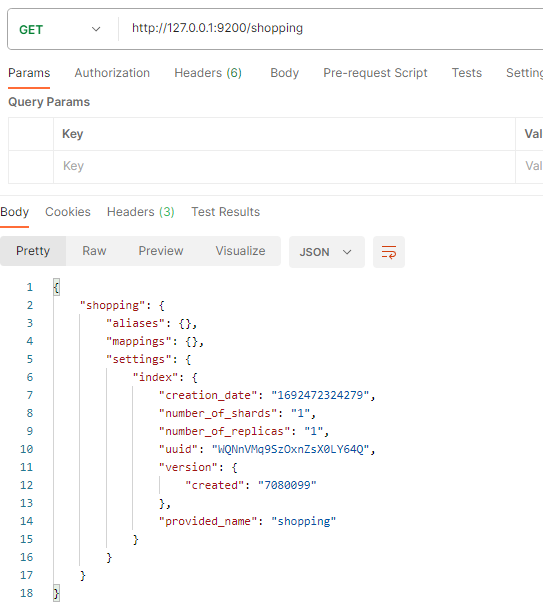

# 一、ElasticSearch
## 1.介绍
Elasticsearch（简称为ES）是一个开源的分布式搜索和分析引擎，构建在Apache Lucene之上。它专注于实时数据分析和搜索，并且具有高性能、可扩展性和灵活性。Elasticsearch 主要用于处理大规模的数据集，从中提取有价值的信息，以便用于搜索、分析和可视化。

以下是 Elasticsearch 的一些重要特点和概念：

1. **分布式架构：** Elasticsearch 是一个分布式系统，数据被分割成多个分片（shards）并分布在不同的节点上。这使得 Elasticsearch 能够处理大规模数据，提供高吞吐量和低延迟的查询。

2. **实时性能：** Elasticsearch 支持实时索引和搜索，使得数据的变更能够在短时间内反映在搜索结果中，适用于实时监控、日志分析等场景。

3. **多种数据类型：** Elasticsearch 可以存储和处理各种不同类型的数据，包括文本、数字、地理位置、日期等。

4. **全文搜索：** Elasticsearch 基于 Lucene 引擎，具有强大的全文搜索和分析能力，支持多字段、模糊搜索、词条匹配等。

5. **多样化查询：** 支持丰富的查询语言，如基于 JSON 的查询、过滤器、聚合、模糊查询、范围查询等。

6. **分析和聚合：** Elasticsearch 提供了强大的聚合和分析功能，可以对数据进行统计、分组、求和、平均等操作。

7. **地理信息：** 支持地理坐标的索引和查询，适用于地理信息系统（GIS）和位置数据分析。

8. **插件生态系统：** Elasticsearch 提供了丰富的插件，可以扩展其功能，如可视化工具、安全性增强、数据导入等。

9. **开源和社区支持：** Elasticsearch 是开源项目，拥有强大的社区支持，可以获得丰富的文档、示例和问题解答。

Elasticsearch 在多个领域中得到广泛应用，例如：

- **日志分析：** 处理和分析大量的日志数据，用于故障排查、监控和可视化。

- **全文搜索引擎：** 用于构建搜索引擎、文档检索系统和电子商务网站的搜索功能。

- **数据分析：** 通过聚合和分析大量数据，从中获取洞察和统计信息。

- **地理信息系统：** 处理地理坐标数据，支持地理位置查询和分析。

总之，Elasticsearch 是一个功能强大的搜索和分析引擎，适用于多种场景，从实时数据分析到全文搜索。

## 2.安装
略

## 3. 一些概念
### 3.1 倒排索引
略

## 4.入门
### 4.1 HTTP
#### 4.1.1 索引
##### 4.1.1.1 创建
对比关系型数据库，创建索引等同于创建数据库。


##### 4.2.1.2 查看所有索引
向 ES 服务器发 GET 请求 ：http://127.0.0.1:9200/_cat/indices?v

这里请求路径中的_cat表示查看的意思，indices表示索引，v表示将信息详细展现出来，所以整体含义就是查看当前 ES服务器中的所有索引，就好像 MySQL 中的 show tables 的感觉，服务器响应结果如下：


表头 | 含义
---|---
health | 当前服务器健康状态：green(集群完整) yellow(单点正常、集群不完整) red(单点不正常)
status | 索引打开、关闭状态
index | 索引名
uuid | 索引统一编号
pri | 主分片数量
rep | 副本数量
docs.count | 可用文档数量
docs.deleted | 文档删除状态（逻辑删除）
store.size | 主分片和副分片整体占空间大小
pri.store.size | 主分片占空间大小

##### 4.2.1.3 查看单个索引
向 ES 服务器发 GET 请求 ：http://127.0.0.1:9200/shopping


##### 4.2.1.4 删除索引
向 ES 服务器发 DELETE 请求 ：http://127.0.0.1:9200/shopping

#### 4.1.2 文档
索引已经创建好了，接下来我们来创建文档，并添加数据。这里的文档可以类比为关系型数据库中的表数据，添加的数据格式为 JSON 格式。
##### 4.1.2.1 创建文档
向 ES 服务器发 POST 请求 ：http://127.0.0.1:9200/shopping/_doc
请求体内容为：
```
{
 "title":"小米手机",
 "category":"小米",
 "images":"http://localhost/xm.jpg",
 "price":3999.00
}
```
服务器响应结果如下：
```
{
 "_index"【索引】: "shopping",
 "_type"【类型-文档】: "_doc",
 "_id"【唯一标识】: "Xhsa2ncBlvF_7lxyCE9G", #可以类比为 MySQL 中的主键，随机生成
 "_version"【版本】: 1,
 "result"【结果】: "created", #这里的 create 表示创建成功
 "_shards"【分片】: {
 "total"【分片 - 总数】: 2,
 "successful"【分片 - 成功】: 1,
 "failed"【分片 - 失败】: 0
 },
 "_seq_no": 0,
 "_primary_term": 1
}
```
上面的数据创建后，由于没有指定数据唯一性标识（ID），默认情况下，ES服务器会随机生成一个。
如果想要自定义唯一性标识，需要在创建时指定：http://127.0.0.1:9200/shopping/_doc/1
==此处需要注意：如果增加数据时明确数据主键，那么请求方式也可以为 PUT==

##### 4.1.2.2 查看文档
查看文档时，需要指明文档的唯一性标识，类似于 MySQL 中数据的主键查询。
向 ES 服务器发 GET 请求 ：http://127.0.0.1:9200/shopping/_doc/1

```
{
 "_index"【索引】: "shopping",
 "_type"【文档类型】: "_doc",
 "_id": "1",
 "_version": 2,
 "_seq_no": 2,
 "_primary_term": 2,
 "found"【查询结果】: true, # true 表示查找到，false 表示未查找到
 "_source"【文档源信息】: {
 "title": "华为手机",
 "category": "华为",
 "images": "http://www.gulixueyuan.com/hw.jpg",
 "price": 4999.00
 }
}
```

##### 4.1.2.3 修改文档
和新增文档一样，输入相同的URL地址请求，如果请求体变化，会将原有的数据内容覆盖
向 ES 服务器发 POST 请求 ：http://127.0.0.1:9200/shopping/_doc/1
请求体内容为:

```
{
 "title":"华为1手机",
 "category":"华为1",
 "images":"http://www.gulixueyuan.com/hw.jpg",
 "price":4999.00
}
```
响应结果：
```
{
 "_index": "shopping",
 "_type": "_doc",
 "_id": "1",
 "_version"【版本】: 2,
 "result"【结果】: "updated", # updated 表示数据被更新
 "_shards": {
 "total": 2,
 "successful": 1,
 "failed": 0
 },
 "_seq_no": 2,
 "_primary_term": 2
}
```

##### 4.1.2.4 修改字段
修改数据时，也可以只修改某一给条数据的局部信息
向 ES 服务器发 POST 请求 ：http://127.0.0.1:9200/shopping/_update/1
请求体内容为：

```
{ 
 "doc": {
 "price":3000.00
 } 
}
```

##### 4.1.2.5 删除文档
删除一个文档不会立即从磁盘上移除，它只是被标记成已删除（逻辑删除）。
向 ES 服务器发 DELETE 请求 ：http://127.0.0.1:9200/shopping/_doc/1
删除成功，服务器响应结果：

```
{
 "_index": "shopping",
 "_type": "_doc",
 "_id": "1",
 "_version"【版本】: 4, #对数据的操作，都会更新版本
 "result"【结果】: "deleted", # deleted 表示数据被标记为删除
 "_shards": {
 "total": 2,
 "successful": 1,
 "failed": 0
 },
 "_seq_no": 4,
 "_primary_term": 2
}
```
如果删除一个并不存在的文档

```
{
 "_index": "shopping",
 "_type": "_doc",
 "_id": "1",
 "_version": 1,
 "result"【结果】: "not_found", # not_found 表示未查找到
 "_shards": {
 "total": 2,
 "successful": 1,
 "failed": 0
 },
 "_seq_no": 5,
 "_primary_term": 2
}
```

##### 4.1.2.6 条件删除文档
一般删除数据都是根据文档的唯一性标识进行删除，实际操作时，也可以根据条件对多条数据进行删除。
向 ES 服务器发 POST 请求 ：http://127.0.0.1:9200/shopping/_delete_by_query
请求体内容为：

```
{
    "query":{
      "match":{
         "price":4000.00
      }
    }
}
```
删除成功后，服务器响应结果：

```
{
 "took"【耗时】: 175,
 "timed_out"【是否超时】: false,
 "total"【总数】: 2,
 "deleted"【删除数量】: 2,
 "batches": 1,
 "version_conflicts": 0,
 "noops": 0,
 "retries": {
 "bulk": 0,
 "search": 0
 },
 "throttled_millis": 0,
 "requests_per_second": -1.0,
 "throttled_until_millis": 0,
 "failures": []
}
```


# 附录：
## 问题解决：
1.Elasticsearch 是使用 java 开发的，且 7.8 版本的 ES 需要 JDK 版本 1.8 以上，默认安装包带有 jdk 环境，如果系统配置 JAVA_HOME，那么使用系统默认的 JDK，如果没有配置使用自带的 JDK，一般建议使用系统配置的 JDK。

2.双击启动窗口闪退，通过路径访问追踪错误，如果是“空间不足”，请修改
config/jvm.options 配置文件。
```
# 设置 JVM 初始内存为 1G。此值可以设置与-Xmx 相同，以避免每次垃圾回收完成后 JVM 重新分配内存
# Xms represents the initial size of total heap space
# 设置 JVM 最大可用内存为 1G
# Xmx represents the maximum size of total heap space
-Xms1g
-Xmx1g
```

