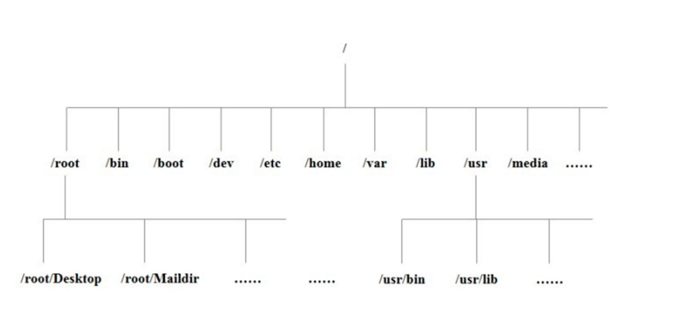
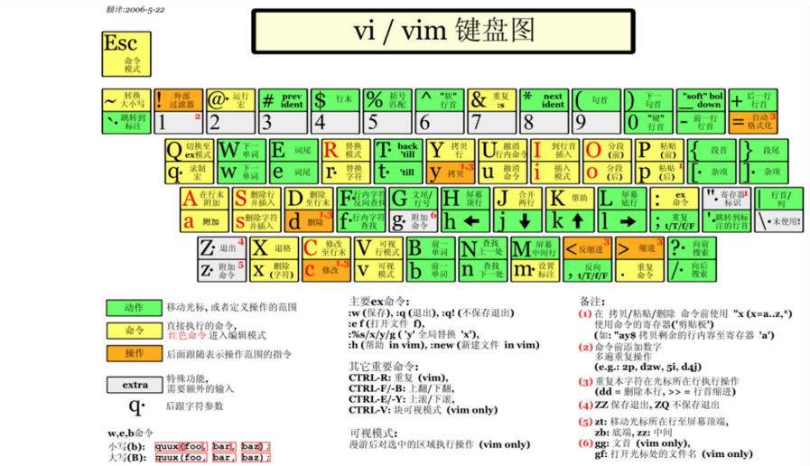
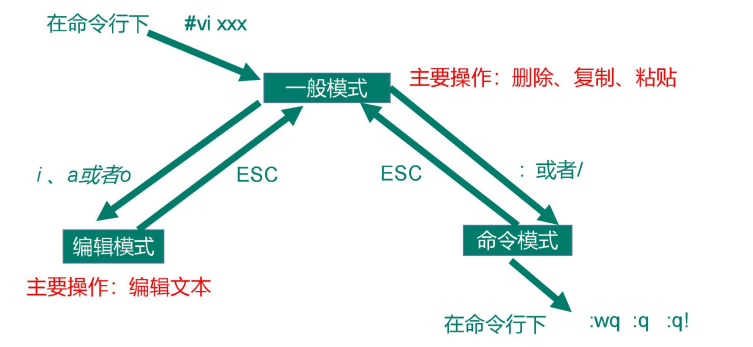
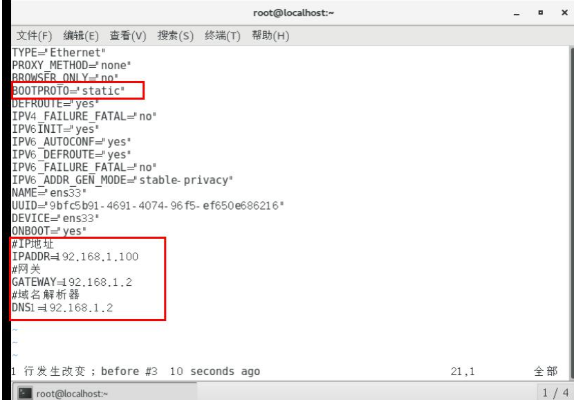
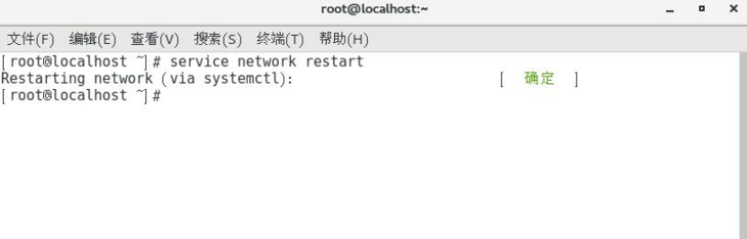
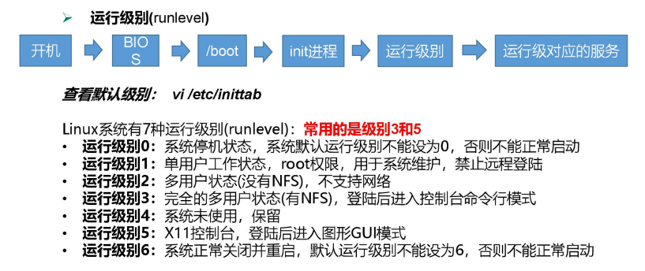
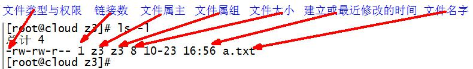

# 一、Linux文件与目录结构
## 1.1 Linux文件
Linux系统中一切皆文件。

## 1.2 Linux目录结构


- /bin

是Binary的缩写，存放最经常使用的命令

- /sbin

s就是 super user的意思，存放着系统管理员使用的系统管理程序。 

- /home

存放普通用户的主目录，在Linux中每个用户都有一个自己的目录，一般该目录名是以用户的账号命名的。

- /root

该目录为系统管理员，也称作超级权限者的用户目录。

- /lib

系统开机所需要最基本的动态链接共享库，其作用类似于Windows里的DLL文件。几乎所有的应用程序都需要用到这些共享库。

- /lost+found

这个目录一般情况下是空的，当系统非法关机后，这里就存放了一些文件。

- /etc

所有的系统管理所需要的配置文件和子目录。

- /usr

这是一个非常重要的目录，用户的很多应用程序和文件都放在这个目录下，类似于windows下的program files目录。

- /boot

这里存放的是启动Linux时使用的一些核心文件，包括一些连接文件以及镜像文件，自己的安装别放这里。

- /proc

这个目录是一个虚拟目录，它是系统内存的映射，我们可以通过直接访问这个目录来获取系统信息。

- /srv

service缩写，该目录存放一些服务启动之后需要提取的数据。

- /sys

这是linux2.6内核的一个很大的变化。该目录下安装了2.6内核中新出现的一个文件系统sysfs。

- /tmp

这个目录是用来存放一些临时文件的。

- /dev

类似于windows的设备管理器，把所有的硬件用文件的形式存储。

- /media(CentOs6)

- linux系统会自动识别一些设备，例如：U盘、光驱等等，当识别后，linux会把识别的设备挂载到这个目录下。
- CentOs迁移到/run/media

- /mnt

系统提供该目录是为了让用户临时挂载别的文件系统的，我们可以将外部的存储挂载在/mnt上，然后进入该目录就可以查看里面的内容了。
 
- /opt

这是给主机额外安装软件所摆放的目录。比如你安装了一个mysql数据库则就可以放到这个目录下。默认是空的。

- /var
存放着在不断扩充的东西，我们习惯将那些经常被修改的目录放在这个目录下。包括各种日志。


# 二、VI/VIM编辑器(重要)
### 2.1 是什么
VI 是 Unix 操作系统和类 Unix 操作系统中最通用的文本编辑器。

VIM 编辑器是从 VI 发展出来的一个性能更强大的文本编辑器。可以主动的以字体颜
色辨别语法的正确性，方便程序设计。VIM 与 VI 编辑器完全兼容。

### 2.2 测试数据准备
**1）拷贝/etc/profile 数据到/root 目录下**

```
[root@XXX 桌面]# cp /etc/profile /root
[root@XXX 桌面]# cd /root/
```

### 2.3 一般模式
以 vi 打开一个档案就直接进入一般模式了（这是默认的模式）。在这个模式中， 你可以使用『上下左右』按键来移动光标，你可以使用『删除字符』或『删除整行』来处理档案内容， 也可以使用『复制、粘贴』来处理你的文件数据。

常用语法：
语法  | 功能描述
---|---
yy  | 复制光标当前一行
y  | 数字 y 复制一段（从第几行到第几行）
p  | 箭头移动到目的行粘贴
u  | 撤销上一步
dd  | 删除光标当前行
d  | 数字 d 删除光标（含）后多少行
x  | 剪切一个字母，相当于 del
X  | 剪切一个字母，相当于 Backspace
yw  | 复制一个词
dw  | 删除一个词
shift+6（^）  | 移动到行头
shift+4 （$）  | 移动到行尾
1+shift+g  | 移动到页头，数字
shift+g  | 移动到页尾
数字+shift+g  | 移动到目标行




### 2.4 编辑模式
在一般模式中可以进行删除、复制、粘贴等的动作，但是却无法编辑文件内容的！要
等到你按下『i, I, o, O, a, A』等任何一个字母之后才会进入编辑模式。

**注意了**！通常在Linux中，按下这些按键时，在画面的左下方会出现『INSERT或
REPLACE』的字样，此时才可以进行编辑。而如果要回到一般模式时， 则必须要按下
『Esc』这个按键即可退出编辑模式。

**1）进入编辑模式**
常用语法：
按键  | 功能
---|---
i  | 当前光标前
a  | 当前光标后
o  | 当前光标行的下一行
I  | 光标所在行最前
A  | 光标所在行最后
O  | 当前光标行的上一行

**2）退出编辑模式**
按『Esc』键 退出编辑模式，之后所在的模式为一般模式。

### 2.5 指令模式
在一般模式当中，输入『 : /?』3个中的任何一个按钮，就可以将光标移动到最底下那
一行。

在这个模式当中， 可以提供你『搜寻资料』的动作，而读取、存盘、大量取代字符、
离开 vi 、显示行号等动作是在此模式中达成的！

**1）基本语法**
命令  | 功能
---|---
:w  | 保存
:q  | 退出
:!  | 强制执行
/要查找的词  | n 查找下一个，N 往上查找
:noh  | 取消高亮显示
:set  | nu 显示行号
:set  | nonu 关闭行号
:%s/old/new/g  | 替换内容 /g 替换匹配到的所有内容

**2）案例实操**


### 2.6 模式间切换



# 三、网络配置(重点)

## 3.1 查看网络ip地址
### 3.1.1 ifconfig 配置网络接口
ifconfig :network interfaces configuring 网络接口配置
#### 1）基本语法
ifconfig （功能描述：显示所有网络接口的配置信息）

#### 2）案例实操
**（1）查看当前网络 ip**
```
[root@XXX 桌面]# ifconfig
```


### 3.1.2 ping 测试主机之间网络连通性
#### 1）基本语法
ping 目的主机 （功能描述：测试当前服务器是否可以连接目的主机）

#### 2）案例实操
**（1）测试当前服务器是否可以连接百度**
```
[root@XXX 桌面]# ping www.baidu.com
```

### 3.1.3 修改 IP 地址
#### 1） 查看 IP 配置文件
```
[root@XXX 桌面]#vim /etc/sysconfig/network-scripts/ifcfg-ens33
```
以下标红的项必须修改，有值的按照下面的值修改，没有该项的要增加。

```
TYPE="Ethernet" #网络类型（通常是 Ethemet）
PROXY_METHOD="none"
BROWSER_ONLY="no"
BOOTPROTO="static" #IP 的配置方法[none|static|bootp|dhcp]（引导
时不 使用协议|静态分配 IP|BOOTP 协议|DHCP 协议）
DEFROUTE="yes"
IPV4_FAILURE_FATAL="no"
IPV6INIT="yes"
IPV6_AUTOCONF="yes"
IPV6_DEFROUTE="yes"
IPV6_FAILURE_FATAL="no"
IPV6_ADDR_GEN_MODE="stable-privacy"
NAME="ens33"
UUID="e83804c1-3257-4584-81bb-660665ac22f6" #随机 id
DEVICE="ens33" #接口名（设备,网卡）
ONBOOT="yes" #系统启动的时候网络接口是否有效（yes/no）
#IP 地址
IPADDR=192.168.1.100
#网关
GATEWAY=192.168.1.2
#域名解析器
DNS1=192.168.1.2
```
编辑完后，按键盘 esc ，然后输入 :wq 回车即可。


#### 2）执行 service network restart 重启网络



### 3.1.4 修改 IP 地址后可能会遇到的问题
- （1）物理机能 ping 通虚拟机，但是虚拟机ping不通物理机,一般都是因为物理机的
防火墙问题,把防火墙关闭就行
- （2）虚拟机能 Ping 通物理机,但是虚拟机 Ping 不通外网,一般都是因为 DNS 的设置有问题
- （3）虚拟机 Ping www.baidu.com 显示域名未知等信息,一般查看 GATEWAY 和 DNS 设置是否正确
- （4）如果以上全部设置完还是不行，需要关闭 NetworkManager 服务
  - systemctl stop NetworkManager 关闭
  - ystemctl disable NetworkManager 禁用
- （5）如果检查发现 systemctl status network 有问题 需要检查 ifcfg-ens33

## 3.2 配置主机名
### 3.2.1 修改主机名称
#### 1） 基本语法
hostname （功能描述：查看当前服务器的主机名称）

#### 2） 案例实操
**（1）查看当前服务器主机名称**
```
[root@XXX 桌面]# hostname
```

** （2）如果感觉此主机名不合适，我们可以进行修改。通过编辑/etc/hostname 文件**
```
[root@XXX 桌面]# vi /etc/hostname
```

修改完成后重启生效。

### 3.2.2 修改hosts映射文件
**1）修改 linux 的主机映射文件（hosts 文件）**
（1）打开/etc/hosts
```
[root@XXX 桌面]# vim /etc/hosts
```
添加如下内容:
```
192.168.2.100 hadoop100
192.168.2.101 hadoop101
192.168.2.102 hadoop102
192.168.2.103 hadoop103
192.168.2.104 hadoop104
192.168.2.105 hadoop105
```
（2）重启设备，重启后，查看主机名，已经修改成功


## 3.3 远程登陆
通常在工作过程中，公司中使用的真实服务器或者是云服务器，都不允许除运维人员
之外的员工直接接触，因此就需要通过远程登录的方式来操作。所以，远程登录工具就是必不可缺的，目前，比较主流的有 Xshell, SSH Secure Shell,SecureCRT,FinalShell 等

# 四、系统管理
## 4.1 Linux 中的进程和服务
计算机中，一个正在执行的程序或命令，被叫做“进程”（process）。

启动之后一只存在、常驻内存的进程，一般被称作“服务”（service）。

## 4.2 service 服务管理（CentOS 6 版本-了解）
### 1） 基本语法
service 服务名 start | stop |· restart | status
### 2） 经验技巧
查看服务的方法：/etc/init.d/服务名 ,发现只有两个服务保留在 service

```
[root@XXX init.d]# pwd
/etc/init.d
[root@XXX init.d]# ls -al
drwxr-xr-x. 2 root root 4096 3 月 19 15:24 .
drwxr-xr-x. 10 root root 4096 3 月 19 15:24 ..
-rw-r--r--. 1 root root 18104 1 月 3 2018 functions
-rwxr-xr-x. 1 root root 4334 1 月 3 2018 netconsole
-rwxr-xr-x. 1 root root 7293 1 月 3 2018 network
-rw-r--r--. 1 root root 1160 4 月 11 2018 README
```

### 3） 案例实操
#### （1）查看网络服务的状态
```
[root@XXX 桌面]#service network status
```

#### （2）停止网络服务
```
[root@XXX 桌面]#service network stop
```

#### （3）启动网络服务
```
[root@XXX 桌面]#service network start
```

#### （4）重启网络服务
```
[root@XXX 桌面]#service network restart
```

## 4.3 chkconfig 设置后台服务的自启配置（CentOS 6 版本）
### 1） 基本语法
- chkconfig （功能描述：查看所有服务器自启配置）
- chkconfig 服务名 off （功能描述：关掉指定服务的自动启动）
- chkconfig 服务名 on （功能描述：开启指定服务的自动启动）
- chkconfig 服务名 --list （功能描述：查看服务开机启动状态）

### 2） 案例实操
#### （1）开启/关闭 network(网络)服务的自动启动
```
[root@XXX 桌面]#chkconfig network on

[root@XXX 桌面]#chkconfig network off
```

#### （2）开启/关闭 network 服务指定级别的自动启动
```
[root@XXX 桌面]#chkconfig --level 指定级别 network on

[root@XXX 桌面]#chkconfig --level 指定级别 network off
```


## 4.4 systemctl （CentOS 7 版本-重点掌握）
### 1） 基本语法
systemctl start | stop | restart | status 服务名

### 2） 经验技巧
查看服务的方法：/usr/lib/systemd/system
```
[root@XXX system]# pwd
/usr/lib/systemd/system
[root@XXX init.d]# ls -al
-rw-r--r--. 1 root root 275 4 月 27 2018 abrt-ccpp.service
-rw-r--r--. 1 root root 380 4 月 27 2018 abrtd.service
-rw-r--r--. 1 root root 361 4 月 27 2018 abrt-oops.service
-rw-r--r--. 1 root root 266 4 月 27 2018 abrt-pstoreoops.service
-rw-r--r--. 1 root root 262 4 月 27 2018 abrt-vmcore.service
-rw-r--r--. 1 root root 311 4 月 27 2018 abrt-xorg.service
-rw-r--r--. 1 root root 751 4 月 11 2018 accounts-daemon.service
-rw-r--r--. 1 root root 527 3 月 25 2017 alsa-restore.service
-rw-r--r--. 1 root root 486 3 月 25 2017 alsa-state.service
……
```
### 3）案例实操
#### （1）查看防火墙服务的状态
```
[root@XXX 桌面]# systemctl status firewalld
```

#### （2）停止防火墙服务
```
[root@XXX 桌面]# systemctl stop firewalld
```

#### （3）启动防火墙服务
```
[root@XXX 桌面]# systemctl start firewalld
```

#### （4）重启防火墙服务
```
[root@XXX 桌面]# systemctl restart firewalld
```

## 4.5 systemctl 设置后台服务的自启配置
### 1）基本语法
- systemctl list-unit-files （功能描述：查看服务开机启动状态）
- systemctl disable service_name （功能描述：关掉指定服务的自动启动）
- systemctl enable service_name （功能描述：开启指定服务的自动启动）


### 2）案例实操
#### （1）开启/关闭 iptables(防火墙)服务的自动启动
```
[root@XXX 桌面]# systemctl enable firewalld.service
[root@XXX 桌面]# systemctl disable firewalld.service
```

## 4.6 系统运行级别
### 1）Linux 运行级别[CentOS 6]


### 2）CentOS7 的运行级别简化为:
- multi-user.target 等价于原运行级别 3（多用户有网，无图形界面）
- graphical.target 等价于原运行级别 5（多用户有网，有图形界面）
### 3） 查看当前运行级别:
```
systemctl get-default
```

### 4）修改当前运行级别
```
systemctl set-default TARGET.target （这里 TARGET 取 multi-user 或者 graphical）
```

## 4.7 关闭防火墙
### 1） 临时关闭防火墙
#### （1）查看防火墙状态
```
[root@XXX 桌面]# systemctl status firewalld
```

#### （2）临时关闭防火墙
```
[root@XXX 桌面]# systemctl stop firewalld
```

### 2）开机启动时关闭防火墙
#### （1）查看防火墙开机启动状态
```
[root@XXX 桌面]# systemctl enable firewalld.service
```

#### （2）设置开机时关闭防火墙
```
[root@XXX 桌面]# systemctl disable firewalld.service
```

## 4.8 关机重启命令
在 linux 领域内大多用在服务器上，很少遇到关机的操作。毕竟服务器上跑一个服务是永无止境的，除非特殊情况下，不得已才会关机。

### 1）基本语法
- （1）sync （功能描述：将数据由内存同步到硬盘中）
- （2）halt （功能描述：停机，关闭系统，但不断电）
- （3）poweroff （功能描述：关机，断电）
- （3）reboot （功能描述：就是重启，等同于 shutdown -r now）
- （4）shutdown [选项] 时间

选项  | 功能
---|---
-H  | 相当于--halt，停机
-r  | -r=reboot 重启

参数  | 功能
---|---
now  | 立刻关机
时间  | 等待多久后关机（时间单位是分钟）。


### 2） 经验技巧
Linux 系统中为了提高磁盘的读写效率，对磁盘采取了 “预读迟写”操作方式。当用户
保存文件时，Linux 核心并不一定立即将保存数据写入物理磁盘中，而是将数据保存在缓冲区中，等缓冲区满时再写入磁盘，这种方式可以极大的提高磁盘写入数据的效率。但是，也带来了安全隐患，如果数据还未写入磁盘时，系统掉电或者其他严重问题出现，则将导致数据丢失。使用 sync 指令可以立即将缓冲区的数据写入磁盘。


### 3）案例实操
#### （1）将数据由内存同步到硬盘中
```
[root@XXX 桌面]#sync
```

#### （2）重启
```
[root@XXX 桌面]# reboot
```

#### （3）停机（不断电）
```
[root@XXX 桌面]#halt
```

#### （4）计算机将在 1 分钟后关机，并且会显示在登录用户的当前屏幕中
```
[root@XXX 桌面]#shutdown -h 1 ‘This server will shutdown after 1 mins’
```

#### （5）立马关机（等同于 poweroff）
```
[root@XXX 桌面]# shutdown -h now
```

#### （6）系统立马重启（等同于 reboot）
```
[root@XXX 桌面]# shutdown -r now
```


# 五、常用基本命令（重要）
## 5.1 帮助命令
### 5.1.1 man 获得帮助信息
#### 1）基本语法
man [命令或配置文件] （功能描述：获得帮助信息）

#### 2）显示说明
信息 | 功能
---|---
NAME | 命令的名称和单行描述
SYNOPSIS | 怎样使用命令
DESCRIPTION | 命令功能的深入讨论
EXAMPLES | 怎样使用命令的例子
SEE ALSO | 相关主题（通常是手册页）

#### 3）案例实操
**（1）查看 ls 命令的帮助信息**
```
[root@XXX ~]# man ls
```

### 5.1.2 help 获得 shell 内置命令的帮助信息
一部分基础功能的系统命令是直接内嵌在 shell 中的，系统加载启动之后会随着 shell 一起加载，常驻系统内存中。这部分命令被称为“内置（built-in）命令”；相应的其它命令被称为“外部命令”。

#### 1）基本语法
help 命令（功能描述：获得 shell 内置命令的帮助信息）

#### 2）案例实操
**（1）查看 cd 命令的帮助信息**
```
[root@XXX ~]# help cd
```

### 5.1.3 常用快捷键
常用快捷键 | 功能
---|---
ctrl + c | 停止进程
ctrl+l | 清屏，等同于 clear；彻底清屏是：reset
善于用 tab 键 | 提示(更重要的是可以防止敲错)
上下键 | 查找执行过的命令

## 5.2 文件目录类
### 5.2.1 pwd 显示当前工作目录的绝对路径
pwd:print working directory 打印工作目录
#### 1）基本语法
pwd （功能描述：显示当前工作目录的绝对路径）
#### 2）案例实操
**（1）显示当前工作目录的绝对路径**
```
[root@XXX ~]# pwd
/root
```
### 5.2.2 ls 列出目录的内容
ls:list 列出目录内容
#### 1）基本语法
ls [选项] [目录或是文件]
#### 2）选项说明
选项 |  功能
---|---
-a  |  全部的文件，连同隐藏档( 开头为 . 的文件) 一起列出来(常用) 
-l  | 长数据串列出，包含文件的属性与权限等等数据；(常用)等价于“ll”

#### 3）显示说明
每行列出的信息依次是： 文件类型与权限 链接数 文件属主 文件属组 文件大小用byte来表示 建立或最近修改的时间 名字

#### 4）案例实操
**（1）查看当前目录的所有内容信息**
```
[atguigu@XXX ~]$ ls -al
总用量 44
drwx------. 5 atguigu atguigu 4096 5 月 27 15:15 .
drwxr-xr-x. 3 root root 4096 5 月 27 14:03 ..
drwxrwxrwx. 2 root root 4096 5 月 27 14:14 hello
-rwxrw-r--. 1 atguigu atguigu 34 5 月 27 14:20 test.txt
```

### 5.2.3 cd 切换目录
cd:Change Directory 切换路径
#### 1）基本语法
cd [参数]
#### 2）参数说明
参数  |  功能
---|---
cd 绝对路径  |  切换路径
cd 相对路径  |  切换路径
cd ~或者 cd  |  回到自己的家目录
cd -  |  回到上一次所在目录
cd ..  |  回到当前目录的上一级目录
cd -P  |  跳转到实际物理路径，而非快捷方式路径

#### 3）案例实操
**（1）使用绝对路径切换到 root 目录**
```
[root@XXX ~]# cd /root/
```

**（2）使用相对路径切换到“公共的”目录**
```
[root@XXX ~]# cd 公共的/
```

**（3）表示回到自己的家目录，亦即是 /root 这个目录**
```
[root@XXX 公共的]# cd ~
```

**（4）cd- 回到上一次所在目录**
```
[root@XXX ~]# cd -
```

**（5）表示回到当前目录的上一级目录，亦即是 “/root/公共的”的上一级目录的意思**；
```
[root@XXX 公共的]# cd ..
```

### 5.2.4 mkdir 创建一个新的目录
mkdir:Make directory 建立目录
#### 1）基本语法
mkdir [选项] 要创建的目录
#### 2）选项说明
选项 |  功能
---|---
-p  | 创建多层目录
### 3）案例实操
**（1）创建一个目录**
```
[root@XXX ~]# mkdir xiyou
[root@XXX ~]# mkdir xiyou/mingjie
```

**（2）创建一个多级目录**
```
[root@XXX ~]# mkdir -p xiyou/dssz/meihouwang
```

### 5.2.5 rmdir 删除一个空的目录
rmdir:Remove directory 移除目录
#### 1）基本语法
rmdir 要删除的空目录
#### 2）案例实操
**（1）删除一个空的文件夹**
```
[root@XXX ~]# rmdir xiyou/dssz/meihouwang
```

### 5.2.6 touch 创建空文件
#### 1）基本语法
touch 文件名称
#### 2）案例实操
```
[root@XXX ~]# touch xiyou/dssz/sunwukong.txt
```

### 5.2.7 cp 复制文件或目录
#### 1）基本语法
cp [选项] source dest （功能描述：复制source文件到dest）

##### 选项说明
选项 | 功能
---|---
-r | 递归复制整个文件夹
##### 参数说明
参数  | 功能
---|---
source  | 源文件
dest  | 目标文件
##### 经验技巧
强制覆盖不提示的方法：\cp

#### 2）案例实操
**（1）复制文件**
```
[root@XXX ~]# cp xiyou/dssz/suwukong.txt xiyou/mingjie/
```

**（2）递归复制整个文件夹**
```
[root@XXX ~]# cp -r xiyou/dssz/ ./
```

### 5.2.8 rm 删除文件或目录
#### 1）基本语法
rm [选项] deleteFile （功能描述：递归删除目录中所有内容）
#### 2）选项说明
选项 | 功能
---|---
-r | 递归删除目录中所有内容
-f | 强制执行删除操作，而不提示用于进行确认。
-v | 显示指令的详细执行过程

#### 3）案例实操
**（1）删除目录中的内容**
```
[root@XXX ~]# rm xiyou/mingjie/sunwukong.txt
```
**（2）递归删除目录中所有内容**
```
[root@XXX ~]# rm -rf dssz/
```

### 5.2.9 mv 移动文件与目录或重命名
#### 1）基本语法
- （1）mv oldNameFile newNameFile （功能描述：重命名）
- （2）mv /temp/movefile /targetFolder （功能描述：移动文件）
#### 2）案例实操
**（1）重命名**
```
[root@XXX ~]# mv xiyou/dssz/suwukong.txt xiyou/dssz/houge.txt
```

**（2）移动文件**
```
[root@XXX ~]# mv xiyou/dssz/houge.txt ./
```

### 5.2.10 cat 查看文件内容
查看文件内容，从第一行开始显示。
#### 1）基本语法
cat [选项] 要查看的文件
#### 2）选项说明
选项  | 功能描述
---|---
-n  | 显示所有行的行号，包括空行。
#### 3）经验技巧
一般查看比较小的文件，一屏幕能显示全的。
#### 4）案例实操
**（1）查看文件内容并显示行号**
```
[atguigu@XXX ~]$ cat -n houge.txt
```

### 5.2.11 more 文件内容分屏查看器
more 指令是一个基于 VI 编辑器的文本过滤器，它以全屏幕的方式按页显示文本文件
的内容。more 指令中内置了若干快捷键，详见操作说明。
#### 1）基本语法
more 要查看的文件
#### 2）操作说明
操作 | 功能说明
---|---
空白键 (space) | 代表向下翻一页；
Enter | 代表向下翻『一行』；
q | 代表立刻离开 more ，不再显示该文件内容。
Ctrl+F | 向下滚动一屏
Ctrl+B | 返回上一屏
= | 输出当前行的行号
:f | 输出文件名和当前行的行号

#### 3）案例实操
**（1）采用more查看文件**
```
[root@XXX ~]# more smartd.conf
```

### 5.2.12 less 分屏显示文件内容
less 指令用来分屏查看文件内容，它的功能与 more 指令类似，但是比 more 指令更加强大，支持各种显示终端。less指令在显示文件内容时，并不是一次将整个文件加载之后才显示，而是根据显示需要加载内容，对于显示大型文件具有较高的效率。

#### 1）基本语法
less 要查看的文件
#### 2）操作说明
操作  | 功能说明
---|---
空白键  | 向下翻动一页；
[pagedown]  | 向下翻动一页
[pageup]  | 向上翻动一页；
/字串  | 向下搜寻『字串』的功能；n：向下查找；N：向上查找；
?字串  | 向上搜寻『字串』的功能；n：向上查找；N：向下查找；
q  | 离开 less 这个程序；
#### 3）经验技巧
用SecureCRT时[pagedown]和[pageup]可能会出现无法识别的问题。
#### 4）案例实操
**（1）采用less查看文件**
```
[root@XXX ~]# less smartd.conf
```

### 5.2.13 echo
echo 输出内容到控制台
#### 1）基本语法
echo [选项] [输出内容]

选项：

-e： 支持反斜线控制的字符转换

控制字符 作用
---|---
\\ | 输出\本身
\n | 换行符
\t | 制表符，也就是 Tab 键
#### 2）案例实操
```
[atguigu@XXX ~]$ echo “hello\tworld”
hello\tworld
[atguigu@XXX ~]$ echo -e “hello\tworld”
hello world
```

### 5.2.14 head 显示文件头部内容
head 用于显示文件的开头部分内容，默认情况下 head 指令显示文件的前 10 行内容。

#### 1）基本语法
- head 文件 （功能描述：查看文件头10行内容）
- head -n 5 文件 （功能描述：查看文件头5行内容，5可以是任意行数）

#### 2）选项说明
选项 | 功能
---|---
-n<行数> | 指定显示头部内容的行数

#### 3）案例实操
**（1）查看文件的头2行**
```
[root@XXX ~]# head -n 2 smartd.conf
```
### 5.2.15 tail 输出文件尾部内容
tail 用于输出文件中尾部的内容，默认情况下 tail 指令显示文件的后 10 行内容。
#### 1） 基本语法
- （1）tail 文件 （功能描述：查看文件尾部10行内容）
- （2）tail -n 5 文件 （功能描述：查看文件尾部5行内容，5可以是任意行数）
- （3）tail -f 文件 （功能描述：实时追踪该文档的所有更新）

#### 2） 选项说明
选项 |  功能
---|---
-n<行数>  | 输出文件尾部 n 行内容
-f  | 显示文件最新追加的内容，监视文件变化
#### 3）案例实操
**（1）查看文件尾 1 行内容**
```
[root@XXX ~]# tail -n 1 smartd.conf
```

**（2）实时追踪该档的所有更新**
```
[root@XXX ~]# tail -f houge.txt
```
### 5.2.16 > 输出重定向和 >> 追加
#### 1）基本语法
- （1）ls -l > 文件 （功能描述：列表的内容==写入==文件 a.txt 中（覆盖写））
- （2）ls -al >> 文件 （功能描述：列表的内容==追加==到文件 aa.txt 的末尾）
- （3）cat 文件 1 > 文件 2 （功能描述：将文件 1 的内容覆盖到文件 2）
- （4）echo “内容” >> 文件

#### 2）案例实操
**（1）将 ls 查看信息写入到文件中**
```
[root@XXX ~]# ls -l>houge.txt
```

**（2）将 ls 查看信息追加到文件中**
```
[root@XXX ~]# ls -l>>houge.txt
```

**（3）采用 echo 将 hello 单词追加到文件中**
```
[root@XXX ~]# echo hello>>houge.txt
```

### 5.2.17 ln 软链接
软链接也称为符号链接，类似于 windows 里的快捷方式，有自己的数据块，主要存放
了链接其他文件的路径。

#### 1）基本语法
ln -s [原文件或目录] [软链接名] （功能描述：给原文件创建一个软链接）
#### 2）经验技巧
- 删除软链接： rm -rf 软链接名，而不是 rm -rf 软链接名/
- 如果使用 rm -rf 软链接名/ 删除，会把软链接对应的真实目录下内容删掉
- 查询：通过 ll 就可以查看，列表属性第 1 位是 l，尾部会有位置指向。
#### 3）案例实操
**（1）创建软连接**
```
[root@XXX ~]# mv houge.txt xiyou/dssz/
[root@XXX ~]# ln -s xiyou/dssz/houge.txt ./houzi
[root@XXX ~]# ll
lrwxrwxrwx. 1 root root 20 6 月 17 12:56 houzi ->
xiyou/dssz/houge.txt
```
**（2）删除软连接(注意不要写最后的/)**
```
[root@XXX ~]# rm -rf houzi
```

**（3）进入软连接实际物理路径**
```
[root@XXX ~]# ln -s xiyou/dssz/ ./dssz
[root@XXX ~]# cd -P dssz/
```

### 5.2.18 history 查看已经执行过历史命令
#### 1）基本语法
history （功能描述：查看已经执行过历史命令）
#### 2）案例实操
**（1）查看已经执行过的历史命令**
```
[root@XXX test1]# history
```

## 5.3 日期时间类
### 1）基本语法
date [OPTION]... [+FORMAT]
### 2）选项说明
选项 | 功能
---|---
-d<时间字符串> | 显示指定的“时间字符串”表示的时间，而非当前时间
-s<日期时间> | 设置系统日期时间
### 3）参数说明
参数 | 功能
---|---
<+日期时间格式> | 指定显示时使用的日期时间格式

### 5.3.1 date 显示当前时间
#### 1）基本语法
- （1）date （功能描述：显示当前时间）
- （2）date +%Y （功能描述：显示当前年份）
- （3）date +%m （功能描述：显示当前月份）
- （4）date +%d （功能描述：显示当前是哪一天）
- （5）date "+%Y-%m-%d %H:%M:%S" （功能描述：显示年月日时分秒

#### 2）案例实操
#### （1）显示当前时间信息
```
[root@XXX ~]# date
2017 年 06 月 19 日 星期一 20:53:30 CST
```

#### （2）显示当前时间年月日
```
[root@XXX ~]# date +%Y%m%d
20170619
```

#### （3）显示当前时间年月日时分秒
```
[root@XXX ~]# date "+%Y-%m-%d %H:%M:%S"
2017-06-19 20:54:58
```

### 5.3.2 date 显示非当前时间
#### 1）基本语法
- （1）date -d '1 days ago' （功能描述：显示前一天时间）
- （2）date -d '-1 days ago' （功能描述：显示明天时间）
#### 2）案例实操
**（1）显示前一天**
```
[root@XXX ~]# date -d '1 days ago'
2023 年 08 月 18 日 星期三 21:07:22 CST
```

**（2）显示明天时间**
```
[root@XXX ~]#date -d '-1 days ago'
2023 年 08 月 20 日 星期日 21:07:22 CST
```

### 5.3.3 date 设置系统时间
#### 1）基本语法
date -s 字符串时间
#### 2）案例实操
**（1）设置系统当前时间**
```
[root@XXX ~]# date -s "2017-06-19 20:52:18"
```

### 5.3.4 cal 查看日历
#### 1）基本语法
cal [选项] （功能描述：不加选项，显示本月日历）
#### 2）选项说明
选项 | 功能
---|---
具体某一年 | 显示这一年的日历
#### 3）案例实操
**（1）查看当前月的日历**
```
[root@XXX ~]# cal
```

**（2）查看 2017 年的日历**
```
[root@XXX ~]# cal 2017
```

## 5.4 用户管理命令
### 5.4.1 useradd 添加新用户
#### 1）基本语法
- useradd 用户名 （功能描述：添加新用户）
- useradd -g 组名 用户名 （功能描述：添加新用户到某个组）
#### 2）案例实操
**（1）添加一个用户**
```
[root@XXX ~]# useradd tangseng
[root@XXX ~]#ll /home/
```

### 5.4.2 passwd 设置用户密码
#### 1）基本语法
passwd 用户名 （功能描述：设置用户密码）
#### 2）案例实操
**（1）设置用户的密码**
```
[root@XXX ~]# passwd tangseng
```

### 5.4.3 id 查看用户是否存在
#### 1）基本语法
id 用户名
#### 2）案例实操
**（1）查看用户是否存在**
```
[root@XXX ~]#id tangseng
```

### 5.4.4 cat /etc/passwd 查看创建了哪些用户
#### 1）案例实操
```
[root@XXX ~]# cat /etc/passwd
```

### 5.4.5 su 切换用户
su: swith user 切换用户
#### 1）基本语法
- su 用户名称 （功能描述：切换用户，只能获得用户的执行权限，不能获得环境变量）
- su - 用户名称 （功能描述：切换到用户并获得该用户的环境变量及执行权限）

#### 2）案例实操
**（1）切换用户**
```
[root@XXX ~]#su tangseng
[root@XXX ~]#echo $PATH
/usr/lib64/qt￾3.3/bin:/usr/local/sbin:/usr/local/bin:/sbin:/bin:/usr/sbin:/usr/bin:/root/b
in
[root@XXX ~]#exit

[root@XXX ~]#su - tangseng
[root@XXX ~]#echo $PATH
/usr/lib64/qt￾3.3/bin:/usr/local/bin:/bin:/usr/bin:/usr/local/sbin:/usr/sbin:/sbin:/home/t
angseng/bin
```

### 5.4.6 userdel 删除用户
#### 1）基本语法
- （1）userdel 用户名 （功能描述：删除用户但保存用户主目录）
- （2）userdel -r 用户名 （功能描述：用户和用户主目录，都删除）

#### 2）选项说明
选项 | 功能
---|---
-r | 删除用户的同时，删除与用户相关的所有文件。

#### 3）案例实操
**（1）删除用户但保存用户主目录**
```
[root@XXX ~]#userdel tangseng
[root@XXX ~]#ll /home/
```

**（2）删除用户和用户主目录，都删除**
```
[root@XXX ~]#useradd zhubajie
[root@XXX ~]#ll /home/
[root@XXX ~]#userdel -r zhubajie
[root@XXX ~]#ll /home/
```

### 5.4.7 who 查看登录用户信息
#### 1）基本语法
- （1）whoami （功能描述：显示自身用户名称）
- （2）who am i （功能描述：显示登录用户的用户名以及登陆时间）

#### 2）案例实操
**（1）显示自身用户名称**
```
[root@XXX opt]# whoami
```

**（2）显示登录用户的用户名**
```
[root@XXX opt]# who am i
```

### 5.4.8 sudo 设置普通用户具有 root 权限
#### 1）添加 atguigu 用户，并对其设置密码。
```
[root@XXX ~]#useradd atguigu
[root@XXX ~]#passwd atguigu
```

#### 2）修改配置文件
```
[root@XXX ~]#vi /etc/sudoers
```
修改 /etc/sudoers 文件，找到下面一行(91 行)，在root下面添加一行，如下所示：
```
## Allow root to run any commands anywhere
root ALL=(ALL) ALL
atguigu ALL=(ALL) ALL
```
或者配置成采用 sudo 命令时，不需要输入密码
```
## Allow root to run any commands anywhere
root ALL=(ALL) ALL
atguigu ALL=(ALL) NOPASSWD:ALL
```
修改完毕，现在可以用 atguigu 帐号登录，然后用命令 sudo ，即可获得 root 权限进行操作。
#### 3）案例实操
**（1）用普通用户在/opt 目录下创建一个文件夹**
```
[atguigu@XXX opt]$ sudo mkdir module
[root@XXX opt]# chown atguigu:atguigu module/
```

### 5.4.9 usermod 修改用户
#### 1）基本语法
usermod -g 用户组 用户名
#### 2）选项说明
选项 | 功能
---|---
-g | 修改用户的初始登录组，给定的组必须存在。默认组 id 是 1。
#### 3）案例实操
**（1）将用户加入到用户组**
```
[root@XXX opt]# usermod -g root zhubajie
```

## 5.5 用户组管理命令
每个用户都有一个用户组，系统可以对一个用户组中的所有用户进行集中管理。不同
Linux 系统对用户组的规定有所不同，

如Linux下的用户属于与它同名的用户组，这个用户组在创建用户时同时创建。

用户组的管理涉及用户组的添加、删除和修改。组的增加、删除和修改实际上就是对
/etc/group文件的更新。

### 5.5.1 groupadd 新增组
#### 1）基本语法
groupadd 组名
#### 2）案例实操
**（1）添加一个xitianqujing组**
```
[root@XXX opt]#groupadd xitianqujing
```

### 5.5.2 groupdel 删除组
#### 1）基本语法
groupdel 组名
#### 2）案例实操
**（1）删除xitianqujing组**
```
[root@XXX opt]# groupdel xitianqujing
```

### 5.5.3 groupmod 修改组
#### 1）基本语法
groupmod -n 新组名 老组名
#### 选项说明
选项 | 功能描述
---|---
-n<新组名> | 指定工作组的新组名
#### 3）案例实操
**（1）修改atguigu组名称为atguigu1**
```
[root@XXX ~]#groupadd xitianqujing
[root@XXX ~]# groupmod -n xitian xitianqujing
```

### 5.5.4  cat /etc/group 查看创建了哪些组
#### 1）基本操作
```
[root@XXX atguigu]# cat /etc/group
```

## 5.6 文件权限类
### 5.6.1 文件属性
Linux系统是一种典型的多用户系统，不同的用户处于不同的地位，拥有不同的权限。
为了保护系统的安全性，Linux系统对不同的用户访问同一文件（包括目录文件）的权限做了不同的规定。在Linux中我们可以使用ll或者ls -l命令来显示一个文件的属性以及文件所属的用户和组。
#### 1）从左到右的 10 个字符表示，如图 7-1 所示

如果没有权限，就会出现减号[ - ]而已。从左至右用0-9这些数字来表示:


- （1）0 首位表示类型
- 在Linux中第一个字符代表这个文件是目录、文件或链接文件等等
  - -代表文件
  - d 代表目录
  - l 链接文档(link file)；
- （2）第1-3位确定属主（该文件的所有者）拥有该文件的权限。---User
- （3）第4-6位确定属组（所有者的同组用户）拥有该文件的权限，---Group
- （4）第7-9位确定其他用户拥有该文件的权限 ---Other

#### 2）rwx 作用文件和目录的不同解释
##### （1）作用到文件：
- [ r ]代表可读(read): 可以读取，查看
- [ w ]代表可写(write): 可以修改，但是不代表可以删除该文件，删除一个文件的前提条件是对该文件所在的目录有写权限，才能删除该文件.
- [ x ]代表可执行(execute):可以被系统执行

##### （2）作用到目录：
- [ r ]代表可读(read): 可以读取，ls查看目录内容
- [ w ]代表可写(write): 可以修改，目录内创建+删除+重命名目录
- [ x ]代表可执行(execute):可以进入该目录

#### 3）案例实操

```
[root@XXX ~]# ll
总用量 104
-rw-------. 1 root root 1248 1 月 8 17:36 anaconda-ks.cfg
drwxr-xr-x. 2 root root 4096 1 月 12 14:02 dssz
lrwxrwxrwx. 1 root root 20 1 月 12 14:32 houzi -> xiyou/dssz/houge.tx
```

- （1）如果查看到是文件：链接数指的是硬链接个数。
- （2）如果查看的是文件夹：链接数指的是子文件夹个数。


### 5.6.2 chmod 改变权限
#### 1）基本语法


- 第一种方式变更权限
chmod [{ugoa}{+-=}{rwx}] 文件或目录
- 第二种方式变更权限
chmod [mode=421 ] [文件或目录]

#### 2）经验技巧
u:所有者 g:所有组 o:其他人 a:所有人(u、g、o 的总和)


#### 3）案例实操
**（1）修改文件使其所属主用户具有执行权限**
```
[root@XXX ~]# cp xiyou/dssz/houge.txt ./
[root@XXX ~]# chmod u+x houge.txt
```

**（2）修改文件使其所属组用户具有执行权限**
```
[root@XXX ~]# chmod g+x houge.txt
```

**（3）修改文件所属主用户执行权限,并使其他用户具有执行权限**
```
[root@XXX ~]# chmod u-x,o+x houge.txt
```

**（4）采用数字的方式，设置文件所有者、所属组、其他用户都具有可读可写可执行权限。**
```
[root@XXX ~]# chmod 777 houge.txt
```

**（5）修改整个文件夹里面的所有文件的所有者、所属组、其他用户都具有可读可写可执行权限。**
```
[root@XXX ~]# chmod -R 777 xiyou/
```


### 5.6.3 chown 改变所有者
#### 1）基本语法
chown [选项] [最终用户] [文件或目录] （功能描述：改变文件或者目录的所有
者）
#### 2）选项说明
选项 | 功能
---|---
-R | 递归操作

#### 3）案例实操
**（1）修改文件所有者**
```
[root@hadoop101 ~]# chown atguigu houge.txt
[root@hadoop101 ~]# ls -al
-rwxrwxrwx. 1 atguigu root 551 5 月 23 13:02 houge.txt
```

**（2）递归改变文件所有者和所有组**
```
[root@hadoop101 xiyou]# ll
drwxrwxrwx. 2 root root 4096 9 月 3 21:20 xiyou
[root@hadoop101 xiyou]# chown -R atguigu:atguigu xiyou/
[root@hadoop101 xiyou]# ll
drwxrwxrwx. 2 atguigu atguigu 4096 9 月 3 21:20 xiyou
```

### 5.6.4 chgrp 改变所属组
#### 1）基本语法
chgrp [最终用户组] [文件或目录] （功能描述：改变文件或者目录的所属组）
#### 2）案例实操
**（1）修改文件的所属组**
```
[root@hadoop101 ~]# chgrp root houge.txt
[root@hadoop101 ~]# ls -al
-rwxrwxrwx. 1 atguigu root 551 5 月 23 13:02 houge.txt
```

## 5.7 搜索查找类
### 5.7.1 find 查找文件或者目录
find 指令将从指定目录向下递归地遍历其各个子目录，将满足条件的文件显示在终端。
#### 1）基本语法
find [搜索范围] [选项]
#### 2）选项说明

选项 | 功能
---|---
-name<查询方式> | 按照指定的文件名查找模式查找文件
-user<用户名> | 查找属于指定用户名所有文件
-size<文件大小> | 按照指定的文件大小查找文件,单位为:b —— 块（512 字节）,c —— 字节, w —— 字（2 字节,） k —— 千字节, M —— 兆字节, G —— 吉字节

#### 3）案例实操
**（1）按文件名：根据名称查找/目录下的filename.txt文件。**
```
[root@hadoop101 ~]# find xiyou/ -name "*.txt"
```

 **（2）按拥有者：查找/opt目录下，用户名称为-user的文件**
```
[root@hadoop101 ~]# find xiyou/ -user atguigu
```

 **（3）按文件大小：在/home目录下查找大于200m的文件（+n 大于 -n小于 n等于）**
```
[root@hadoop101 ~]find /home -size +204800
```

### 5.7.2 locate 快速定位文件路径
locate 指令利用事先建立的系统中所有文件名称及路径的 locate 数据库实现快速定位给定的文件。Locate指令无需遍历整个文件系统，查询速度较快。为了保证查询结果的准确度，管理员必须定期更新 locate 时刻。
#### 1）基本语法
locate 搜索文件
#### 2）经验技巧
由于 locate 指令基于数据库进行查询，所以第一次运行前，必须使用 updatedb 指令创建 locate 数据库。
#### 3）案例实操
**（1）查询文件夹**
```
[root@hadoop101 ~]# updatedb
[root@hadoop101 ~]#locate tmp
```

### 5.7.3 grep 过滤查找及“|”管道符
管道符，“|”，表示将前一个命令的处理结果输出传递给后面的命令处理。
#### 1）基本语法
grep 选项 查找内容 源文件
#### 2）选项说明
选项 | 功能
---|---
-n | 显示匹配行及行号。
#### 3）案例实操
**（1）查找某文件在第几行**
```
[root@hadoop101 ~]# ls | grep -n test
```

## 5.8 压缩和解压类
### 5.8.1  gzip/gunzip 压缩
#### 1）基本语法
- gzip 文件 （功能描述：压缩文件，只能将文件压缩为*.gz 文件）
- gunzip 文件.gz （功能描述：解压缩文件命令）

#### 2）经验技巧
- （1）只能压缩文件不能压缩目录
- （2）不保留原来的文件
- （3）同时多个文件会产生多个压缩包

#### 3）案例实操
**（1）gzip压缩**
```
[root@hadoop101 ~]# ls
test.java
[root@hadoop101 ~]# gzip houge.txt
[root@hadoop101 ~]# ls
houge.txt.gz
```
 
**（2）gunzip解压缩文件**
```
[root@hadoop101 ~]# gunzip houge.txt.gz
[root@hadoop101 ~]# ls
houge.txt
```

### 5.8.2 zip/unzip 压缩
#### 1）基本语法
- zip [选项] XXX.zip 将要压缩的内容 （功能描述：压缩文件和目录的命令）
- unzip [选项] XXX.zip （功能描述：解压缩文件）
#### 2）选项说明

zip 选项 | 功能
---|---
-r | 压缩目录

unzip 选项 | 功能
---|---
-d<目录> | 指定解压后文件的存放目录
#### 3）经验技巧
zip 压缩命令在windows/linux都通用，可以压缩目录且保留源文件。
#### 4）案例实操
**（1）压缩 houge.txt 和bailongma.txt，压缩后的名称为mypackage.zip**
```
[root@hadoop101 opt]# touch bailongma.txt
[root@hadoop101 ~]# zip mypackage.zip houge.txt bailongma.txt
adding: houge.txt (stored 0%)
adding: bailongma.txt (stored 0%)
[root@hadoop101 opt]# ls
houge.txt bailongma.txt mypackage.zip
```

**（2）解压 mypackage.zip**
```
[root@hadoop101 ~]# unzip mypackage.zip
Archive: houma.zip
extracting: houge.txt
extracting: bailongma.txt
[root@hadoop101 ~]# ls
houge.txt bailongma.txt mypackage.zip
```

**（3）解压mypackage.zip到指定目录-d**
```
[root@hadoop101 ~]# unzip mypackage.zip -d /opt
[root@hadoop101 ~]# ls /opt/
```


### 5.8.3 tar 打包
#### 1）基本语法
tar [选项] XXX.tar.gz 将要打包进去的内容 （功能描述：打包目录，压缩后的
文件格式.tar.gz）
#### 2）选项说明

选项  | 功能
---|---
-c  | 产生.tar 打包文件
-v  | 显示详细信息
-f  | 指定压缩后的文件名
-z  | 打包同时压缩
-x  | 解包.tar 文件
-C  | 解压到指定目录
#### 3）案例实操
**（1）压缩多个文件**

```
[root@hadoop101 opt]# tar -zcvf houma.tar.gz houge.txt bailongma.txt
houge.txt
bailongma.txt
[root@hadoop101 opt]# ls
houma.tar.gz houge.txt bailongma.txt
```

**（2）压缩目录**

```
[root@hadoop101 ~]# tar -zcvf xiyou.tar.gz xiyou/
xiyou/
xiyou/mingjie/
xiyou/dssz/
xiyou/dssz/houge.txt
```

**（3）解压到当前目录**

```
[root@hadoop101 ~]# tar -zxvf houma.tar.gz （4）解压到指定目录
[root@hadoop101 ~]# tar -zxvf xiyou.tar.gz -C /opt
[root@hadoop101 ~]# ll /opt/
```


## 5.9 磁盘查看和分区类
 
### 5.9.1 du 查看文件和目录占用的磁盘空间
du: disk usage 磁盘占用情况

#### 1）基本语法
du 目录/文件 （功能描述：显示目录下每个子目录的磁盘使用情况）
#### 2）选项说明

选项  | 功能
---|---
-h  | 以人们较易阅读的 GBytes, MBytes, KBytes 等格式自行显示；
-a  | 不仅查看子目录大小，还要包括文件
-c  | 显示所有的文件和子目录大小后，显示总和
-s  | 只显示总和
--max-depth=n  | 指定统计子目录的深度为第 n 层
#### 3）案例实操
**（1）查看当前用户主目录占用的磁盘空间大小**

```
[root@hadoop101 ~]# du -sh
166M .
```


### 5.9.2 df 查看磁盘空间使用情况
df: disk free 空余磁盘
### 1）基本语法
df 选项 （功能描述：列出文件系统的整体磁盘使用量，检查文件系统的磁盘空间占
用情况）
### 2）选项说明
选项 | 功能
---|---
-h | 以人们较易阅读的 GBytes, MBytes, KBytes 等格式自行显示；
### 3）案例实操
**（1）查看磁盘使用情况**

```
[root@hadoop101 ~]# df -h
Filesystem Size Used Avail Use% Mounted on
/dev/sda2 15G 3.5G 11G 26% /
tmpfs 939M 224K 939M 1% /dev/shm
/dev/sda1 190M 39M 142M 22% /boot
```


### 5.9.3 lsblk 查看设备挂载情况
#### 1）基本语法
lsblk （功能描述：查看设备挂载情况）
#### 2）选项说明
选项  | 功能
---|---
-f  | 查看详细的设备挂载情况，显示文件系统信息


### 5.9.4 mount/umount 挂载/卸载
对于Linux用户来讲，不论有几个分区，分别分给哪一个目录使用，它总归就是一个根
目录、一个独立且唯一的文件结构。

Linux中每个分区都是用来组成整个文件系统的一部分，它在用一种叫做“挂载”的处理
方法，它整个文件系统中包含了一整套的文件和目录，并将一个分区和一个目录联系起来，要载入的那个分区将使它的存储空间在这个目录下获得。

#### 基本语法
- mount [-t vfstype] [-o options] device dir （功能描述：挂载设备）
- umount 设备文件名或挂载点 （功能描述：卸载设备）

##### 参数说明

参数  | 功能
---|---
-t vfstype  | 指定文件系统的类型，通常不必指定。mount会自动选择正确的类型。常用类型有：光盘或光盘镜像：iso9660，DOS fat16 文件系统：msdos，Windows 9x fat32 文件系统：vfat，WindowsNTntfs文件系统：ntfs，MountWindows文件网络共享：smbfs，UNIX(LINUX) 文件网络共享：nfs。
-o options |  主要用来描述设备或档案的挂接方式。常用的参数有：loop：用来把一个文件当成硬盘分区挂接上系统，ro：采用只读方式挂接设备，rw：采用读写方式挂接设备，iocharset：指定访问文件系统所用字符集，device 要挂接(mount)的设备，dir 设备在系统上的挂接点(mount point)，
#### 案例实操
**（1）挂载光盘镜像文件**
```
[root@hadoop101 ~]# mkdir /mnt/cdrom/ 建立挂载点
[root@hadoop101 ~]# mount -t iso9660 /dev/cdrom /mnt/cdrom/ 设备/dev/cdrom 挂载到 挂载点 ： /mnt/cdrom 中
[root@hadoop101 ~]# ll /mnt/cdrom/
```

```
**（2）卸载光盘镜像文件**
[root@hadoop101 ~]# umount /mnt/cdrom
```

### 设置开机自动挂载
```
[root@hadoop101 ~]# vi /etc/fstab
```
添加红框中内容，保存退出。

### 5.9.5 fdisk 分区
#### 1）基本语法
- fdisk -l （功能描述：查看磁盘分区详情）
- fdisk 硬盘设备名 （功能描述：对新增硬盘进行分区操作）

#### 2）选项说明

选项  | 功能
---|---
-l  | 显示所有硬盘的分区列表
#### 3）经验技巧
该命令必须在 root 用户下才能使用
#### 4）功能说明
##### （1）Linux 分区
Device：分区序列
Boot：引导
Start：从X磁柱开始
End：到Y磁柱结束
Blocks：容量
Id：分区类型ID
System：分区类型
##### （2）分区操作按键说明
m：显示命令列表
p：显示当前磁盘分区
n：新增分区
w：写入分区信息并退出
q：不保存分区信息直接退出
#### 5）案例实操
**（1）查看系统分区情况**
```
[root@hadoop101 /]# fdisk -l
Disk /dev/sda: 21.5 GB, 21474836480 bytes
255 heads, 63 sectors/track, 2610 cylinders
Units = cylinders of 16065 * 512 = 8225280 bytes
Sector size (logical/physical): 512 bytes / 512 bytes
I/O size (minimum/optimal): 512 bytes / 512 bytes
Disk identifier: 0x0005e654
Device Boot Start End Blocks Id System
/dev/sda1 * 1 26 204800 83 Linux
Partition 1 does not end on cylinder boundary.
/dev/sda2 26 1332 10485760 83 Linux
/dev/sda3 1332 1593 2097152 82 Linux swap / Solaris
```

## 5.10 进程管理类
进程是正在执行的一个程序或命令，每一个进程都是一个运行的实体，都有自己的地
址空间，并占用一定的系统资源。

### 5.10.1  ps 查看当前系统进程状态
ps:process status 进程状态
#### 1）基本语法
- ps aux | grep xxx （功能描述：查看系统中所有进程）
- ps -ef | grep xxx （功能描述：可以查看子父进程之间的关系）

#### 2）选项说明
选项  | 功能
---|---
a  | 列出带有终端的所有用户的进程
x  | 列出当前用户的所有进程，包括没有终端的进程
u  | 面向用户友好的显示风格
-e  | 列出所有进程
-u  | 列出某个用户关联的所有进程
-f  | 显示完整格式的进程列表
#### 3）功能说明
##### （1）ps aux 显示信息说明
- USER：该进程是由哪个用户产生的
- PID：进程的 ID 号
- %CPU：该进程占用 CPU 资源的百分比，占用越高，进程越耗费资源；
- %MEM：该进程占用物理内存的百分比，占用越高，进程越耗费资源；
- VSZ：该进程占用虚拟内存的大小，单位 KB；
- RSS：该进程占用实际物理内存的大小，单位 KB；
- TTY：该进程是在哪个终端中运行的。对于 CentOS 来说，tty1 是图形化终端，
- tty2-tty6 是本地的字符界面终端。pts/0-255 代表虚拟终端。
- STAT：进程状态。常见的状态有：R：运行状态、S：睡眠状态、T：暂停状态、
Z：僵尸状态、s：包含子进程、l：多线程、+：前台显示
- START：该进程的启动时间
- TIME：该进程占用 CPU 的运算时间，注意不是系统时间
- COMMAND：产生此进程的命令名

##### （2）ps -ef 显示信息说明
- UID：用户 ID
- PID：进程 ID
- PPID：父进程 ID
- C：CPU 用于计算执行优先级的因子。数值越大，表明进程是 CPU 密集型运算，执行优先级会降低；数值越小，表明进程是I/O密集型运算，执行优先级会提高
- STIME：进程启动的时间
- TTY：完整的终端名称
- TIME：CPU 时间
- CMD：启动进程所用的命令和参数

#### 4）经验技巧
如果想查看进程的 CPU 占用率和内存占用率，可以使用 aux;

如果想查看进程的父进程 ID 可以使用 ef;
#### 5）案例实操
查看进程的 CPU 占用率和内存占用率
```
[root@XXX datas]# ps aux
```
查看进程的父进程 ID
```
[root@XXX datas]# ps -ef
```

### 5.10.2 kill 终止进程
#### 1）基本语法
- kill [选项] 进程号 （功能描述：通过进程号杀死进程）
- killall 进程名称 （功能描述：通过进程名称杀死进程，也支持通配符，这
在系统因负载过大而变得很慢时很有用）

#### 2）选项说明
选项  | 功能
---|---
-9  | 表示强迫进程立即停止
#### 3）案例实操
##### （1）杀死浏览器进程
```
[root@XXX 桌面]# kill -9 5102
```

##### （2）通过进程名称杀死进程
```
[root@XXX 桌面]# killall firefox
```

### 5.10.3 pstree 查看进程树
#### 1）基本语法
pstree [选项]
#### 2）选项说明
选项  | 功能
---|---
-p  | 显示进程的 PID
-u  | 显示进程的所属用户
#### 3）案例实操
**（1）显示进程 pid**
```
[root@XXX datas]# pstree -p
```

**（2）显示进程所属用户**
```
[root@XXX datas]# pstree -u
```


### 5.10.4 top 实时监控系统进程状态
#### 1）基本命令
top [选项]
#### 2）选项说明
选项  | 功能
---|---
-d 秒数  | 指定 top命令每隔几秒更新。默认是3秒在top命令的交互模式当中可以执行的命令：
-i  | 使 top 不显示任何闲置或者僵死进程。
-p  | 通过指定监控进程 ID 来仅仅监控某个进程的状态。

#### 3） 操作说明
操作  | 功能
---|---
P  | 以 CPU 使用率排序，默认就是此项
M  | 以内存的使用率排序
N  | 以 PID 排序
q  | 退出 top

#### 4）查询结果字段解释
第一行信息为任务队列信息
内容  | 说明
---|---
12:26:46  | 系统当前时间
up 1 day, 13:32  | 系统的运行时间，本机已经运行 1 天13 小时 32 分钟
2 users  | 当前登录了两个用户
load average: 0.00, 0.00, 0.00  |系统在之前1分钟，5分钟，15分钟的平均负载。一般认为小于 1 时，负载较小。如果大于1，系统已经超出负荷。


第二行为进程信息
内容  | 说明
---|---
Tasks: 95 total  | 系统中的进程总数
1 running  | 正在运行的进程数
94 sleeping  | 睡眠的进程
0 stopped  | 正在停止的进程
0 zombie  | 僵尸进程。如果不是 0，需要手工检查僵尸进程
第三行为 CPU 信息
内容  | 说明
---|---
Cpu(s): 0.1%us  | 用户模式占用的 CPU 百分比
0.1%sy  | 系统模式占用的 CPU 百分比
0.0%ni  | 改变过优先级的用户进程占用的 CPU 百分比
99.7%id  | 空闲 CPU 的 CPU 百分比
0.1%wa  | 等待输入/输出的进程的占用 CPU 百分比
0.0%hi  | 硬中断请求服务占用的 CPU 百分比
0.1%si  | 软中断请求服务占用的 CPU 百分比
0.0%st  | st（Steal time）虚拟时间百分比。就是当有虚拟机时，虚拟 CPU 等待实际 CPU 的时间百分比。

第四行为物理内存信息

内容  | 说明
---|---
Mem: 625344k total |  物理内存的总量，单位 KB
571504k used  | 已经使用的物理内存数量
53840k free  | 空闲的物理内存数量，我们使用的是虚拟机，总共只分配了 628MB 内存，所以只有 53MB 的空闲内存了
65800k buffers  | 作为缓冲的内存数量

第五行为交换分区（swap）信息
内容  | 说明
---|---
Swap: 524280k total |  交换分区（虚拟内存）的总大小
0k used  | 已经使用的交互分区的大小
524280k free  | 空闲交换分区的大小
409280k cached  | 作为缓存的交互分区的大小

#### 5）案例实操
```
[root@XXX atguigu]# top -d 1
[root@XXX atguigu]# top -i
[root@XXX atguigu]# top -p 2575
```
执行上述命令后，可以按 P、M、N 对查询出的进程结果进行排序。

### 5.10.5 netstat 显示网络状态和端口占用信息
#### 1）基本语法
- netstat -anp | grep 进程号 （功能描述：查看该进程网络信息）
- netstat –nlp | grep 端口号 （功能描述：查看网络端口号占用情况）
#### 2）选项说明
选项  | 功能
---|---
-a  | 显示所有正在监听（listen）和未监听的套接字（socket）
-n  | 拒绝显示别名，能显示数字的全部转化成数字
-l  | 仅列出在监听的服务状态
-p  | 表示显示哪个进程在调用

#### 3）案例实操
**（1）通过进程号查看sshd进程的网络信息**
```
[root@XXX hadoop-2.7.2]# netstat -anp | grep sshd
tcp 0 0 0.0.0.0:22 0.0.0.0:* LISTEN
951/sshd
tcp 0 0 192.168.202.100:22 192.168.202.1:57741
ESTABLISHED 3380/sshd: root@pts
tcp 0 52 192.168.202.100:22 192.168.202.1:57783
ESTABLISHED 3568/sshd: root@pts
tcp 0 0 192.168.202.100:22 192.168.202.1:57679
ESTABLISHED 3142/sshd: root@pts
tcp6 0 0 :::22 :::* LISTEN
951/sshd
unix 2 [ ] DGRAM 39574 3568/sshd:
root@pts
unix 2 [ ] DGRAM 37452 3142/sshd:
root@pts
unix 2 [ ] DGRAM 48651 3380/sshd:
root@pts
unix 3 [ ] STREAM CONNECTED 21224 951/sshd
```
**（2）查看某端口号是否被占用**

```
[root@XXX 桌面]# netstat -nltp | grep 22
tcp 0 0 192.168.122.1:53 0.0.0.0:* LISTEN
1324/dnsmasq
tcp 0 0 0.0.0.0:22 0.0.0.0:* LISTEN
951/sshd
tcp6 0 0 :::22 :::* LISTEN
951/sshd
```

## 5.11 crontab 系统定时任务

### 5.11.1 crontab 服务管理
#### 1）重新启动 crond 服务
```
[root@XXX ~]# systemctl restart crond
```
 
### 5.11.2 crontab 定时任务设置
#### 1）基本语法
crontab [选项]
#### 2）选项说明
选项  | 功能
---|---
-e  | 编辑 crontab 定时任务
-l  | 查询 crontab 任务
-r  | 删除当前用户所有的 crontab 任务
#### 3）参数说明

```
[root@XXX ~]# crontab -e
```
**（1）进入 crontab 编辑界面。会打开 vim 编辑你的工作。**

*****执行的任务

项目  | 含义  | 范围
---|------|---
第一个“*” |  一小时当中的第几分钟 |  0-59
第二个“*”  | 一天当中的第几小时 |  0-23
第三个“*”  | 一个月当中的第几天 |  1-31
第四个“*”  | 一年当中的第几月 |  1-12
第五个“*” |  一周当中的星期几 |  0-7 （ 0 和 7 都 代 表 星 期日）

**（2）特殊符号**
特殊符号 |  含义
---|---
*  | 代表任何时间。比如第一个“*”就代表一小时中每分钟都执行一次的意思。
，  | 代表不连续的时间。比如“0 8,12,16 * * * 命令”，就代表在每天的 8 点 0 分，12 点 0 分，16 点 0 分都执行一次命令
-  | 代表连续的时间范围。比如“0 5 * * 1-6 命令”，代表在周一到周六的凌晨 5 点 0 分执行命令
*/n  | 代表每隔多久执行一次。比如“*/10 * * * * 命令”，代表每隔 10 分钟就执行一遍命令


**（3）特定时间执行命令**
时间  | 含义
---|---
45 22 * * * 命令  | 每天 22 点 45 分执行命令
0 17 * * 1 命令  | 每周 1 的 17 点 0 分执行命令
0 5 1,15 * * 命令  | 每月 1 号和 15 号的凌晨 5 点 0 分执行命令
40 4 * * 1-5 命令  | 每周一到周五的凌晨 4 点 40 分执行命令
*/10 4 * * * 命令  | 每天的凌晨 4 点，每隔 10 分钟执行一次命令
0 0 1,15 * 1 命令  |每月1号和15号，每周1的0点0分都会执行命令。注意：星期几和几号最好不要同时出现，因为他们定义的都是天。非常容易让管理员混乱。

**4）案例实操**
（1）每隔 1 分钟，向/root/bailongma.txt 文件中添加一个 11 的数字
```
*/1 * * * * /bin/echo ”11” >> /root/bailongma.txt
```


# 六、软件包管理

## 6.1 RPM
### 6.1.1 RPM 概述
RPM（RedHat Package Manager），RedHat软件包管理工具，类似windows里面的setup.exe
是Linux这系列操作系统里面的打包安装工具，它虽然是RedHat的标志，但理念是通用的。
RPM包的名称格式
Apache-1.3.23-11.i386.rpm
- “apache” 软件名称
- “1.3.23-11”软件的版本号，主版本和此版本
- “i386”是软件所运行的硬件平台，Intel 32位处理器的统称
- “rpm”文件扩展名，代表RPM包


### 6.1.2 RPM 查询命令（rpm -qa）
#### 1）基本语法
rpm -qa （功能描述：查询所安装的所有 rpm 软件包）
#### 2）经验技巧
由于软件包比较多，一般都会采取过滤。rpm -qa | grep rpm软件包
#### 3）案例实操
**（1）查询firefox软件安装情况**
```
[root@XXX Packages]# rpm -qa |grep firefox
firefox-45.0.1-1.el6.centos.x86_64
```

### 6.1.3 RPM 卸载命令（rpm -e）
#### 1）基本语法
- （1）rpm -e RPM软件包
- （2） rpm -e --nodeps 软件包

#### 2）选项说明
选项  | 功能
---|---
-e  | 卸载软件包
--nodeps  | 卸载软件时，不检查依赖。这样的话，那些使用该软件包的软件在此之后可能就不能正常工作了。

#### 3）案例实操
**（1）卸载firefox软件**
```
[root@XXX Packages]# rpm -e firefox
```

### 6.1.4 RPM 安装命令（rpm -ivh）
#### 1）基本语法
rpm -ivh RPM 包全名
#### 2）选项说明
选项  | 功能
---|---
-i  | install，安装
-v  | --verbose，显示详细信息
-h  | --hash，进度条
--nodeps  | 安装前不检查依赖
#### 3）案例实操
**（1）安装firefox软件**
```
[root@XXX Packages]# pwd
/run/media/root/CentOS 7 x86_64/Packages
[root@XXX Packages]# rpm -ivh firefox-45.0.1-1.el6.centos.x86_64.rpm
warning: firefox-45.0.1-1.el6.centos.x86_64.rpm: Header V3 RSA/SHA1
Signature, key ID c105b9de: NOKEY
Preparing... ###########################################
[100%]
1:firefox ###########################################
[100%]
```

## 6.2 YUM仓库配置
### 6.2.1 YUM 概述
YUM（全称为 Yellow dog Updater, Modified）是一个在 Fedora 和 RedHat 以及 CentOS中的 Shell 前端软件包管理器。基于RPM包管理，能够从指定的服务器自动下载 RPM 包并且安装，可以自动处理依赖性关系，并且一次安装所有依赖的软件包，无须繁琐地一次次下载、安装。


YUM类似于我们java开发中的maven工具，可以从镜像网站上下载应用程序，并直接安装。

### 6.2.2 YUM 的常用命令
#### 1）基本语法
yum [选项] [参数]
#### 2）选项说明
选项  | 功能
---|---
-y  | 对所有提问都回答“yes”
#### 3）参数说明
参数  | 功能
---|---
install  | 安装 rpm 软件包
update  | 更新 rpm 软件包
check-update  | 检查是否有可用的更新 rpm 软件包
remove  | 删除指定的 rpm 软件包
list  | 显示软件包信息
clean  | 清理 yum 过期的缓存
deplist  | 显示 yum 软件包的所有依赖关系

#### 4）案例实操实操
**（1）采用 yum 方式安装 firefox**
```
[root@XXX ~]#yum -y install firefox
```

# 附：
- 1、查看内存：top
- 2、查看磁盘存储情况：df -h
- 3、查 看磁盘 IO 读写情况：iotop（需要安装一下：yum install iotop）、iotop -o（直接查看输出比较高的磁盘读写程序）
- 4、查看端口占用情况：netstat -tunlp | grep 端口号
- 5、查看进程：ps -aux
