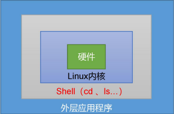

#  一、概述
 Shell是一个命令行解释器，它接收应用程序/用户的命令，然后调用操作系统内核。
 
 
 
 Shell还是一个功能强大的编号语言，易编写、易测试、灵活性强。
 
#####  (1)linux提供的Shell解析器

```
[XXX ~]$ cat /etc/shells
/bin/sh
/bin/bash
/usr/bin/sh
/usr/bin/bash
/bin/tcsh
/bin/csh
```
 
 ##### (2)bash和sh的关系
```
[XXX bin]$ ll | grep bash
-rwxr-xr-x. 1 root root 941880 5 月 11 2016 bash
lrwxrwxrwx. 1 root root 4 5 月 27 2017 sh -> bash
```

 ##### (3)Centos默认的解析器是bash
```
[XXX bin]$ echo $SHELL
/bin/bash
```

# 二、Shell脚本入门
#### (1).脚本格式
脚本以#!/bin/bash 开头（指定解析器）

#### (2)第一个 Shell 脚本：helloworld.sh
##### （1）需求：创建一个 Shell 脚本，输出 helloworld

##### （2）案例实操：

```
[XXX shells]$ touch helloworld.sh
[XXX shells]$ vim helloworld.sh
在 helloworld.sh 中输入如下内容
#!/bin/bash
echo "helloworld"
```

##### （3）脚本的常用执行方式
**第一种：采用 bash 或 sh+脚本的相对路径或绝对路径（不用赋予脚本+x 权限）**

sh+脚本的相对路径
```
[XXX shells]$ sh ./helloworld.sh
Helloworld
```

sh+脚本的绝对路径
```
[XXX shells]$ sh /home/atguigu/shells/helloworld.sh
helloworld
```

bash+脚本的相对路径
```
[XXX shells]$ bash ./helloworld.sh
Helloworld
```

bash+脚本的绝对路径
```
[XXX shells]$ bash /home/atguigu/shells/helloworld.sh
Helloworld
```

**第二种：采用输入脚本的绝对路径或相对路径执行脚本（==必须具有可执行权限+x==）**

**①首先要赋予 helloworld.sh 脚本的+x 权限**
```
[XXX shells]$ chmod +x helloworld.sh
```

**②执行脚本**

相对路径
```
[XXX shells]$ ./helloworld.sh
Helloworld
```

绝对路径
```
[XXX shells]$ /home/atguigu/shells/helloworld.sh
Helloworld
```

**注意**：第一种执行方法，本质是bash解析器帮你执行脚本，所以脚本本身不需要执行权限。第二种执行方法，本质是脚本需要自己执行，所以需要执行权限。

【了解】第三种：在脚本的路径前加上“.”或者 source

**①有以下脚本**
```
[XXX shells]$ cat test.sh
#!/bin/bash
A=5
echo $A
```

**②分别使用 sh，bash，./ 和 . 的方式来执行，结果如下：**
```
[XXX shells]$ bash test.sh
[XXX shells]$ echo $A
[XXX shells]$ sh test.sh
[XXX shells]$ echo $A
[XXX shells]$ ./test.sh
[XXX shells]$ echo $A
[XXX shells]$ . test.sh
[XXX shells]$ echo $A
5
```

**原因：**

前两种方式都是在当前shell中打开一个子shell来执行脚本内容，当脚本内容结束，则
子 shell 关闭，回到父 shell 中。

第三种，也就是使用在脚本路径前加“.”或者 source 的方式，可以使脚本内容在当前
shell 里执行，而无需打开子 shell！这也是为什么我们每次要修改完/etc/profile 文件以后，需要 source 一下的原因。

开子 shell 与不开子 shell 的区别就在于，环境变量的继承关系，如在子 shell 中设置的当前变量，父 shell 是不可见的。


# 三、变量
## 3.1 系统预定义变量
### 3.1.1 常用系统变量
$HOME、$PWD、$SHELL、$USER 等

### 3.1.2 案例实操
**（1）查看系统变量的值**
```
[XXX shells]$ echo $HOME
/home/atguigu
```

**（2）显示当前 Shell 中所有变量：set**
```
[XXX shells]$ set
BASH=/bin/bash
BASH_ALIASES=()
BASH_ARGC=()
BASH_ARGV=()
```

## 3.2 自定义变量
### 3.2.1 基本语法
（1）定义变量：变量名=变量值，==注意，=号前后不能有空格==

（2）撤销变量：unset 变量名

（3）声明静态变量：readonly 变量，==注意：不能 unset==

### 3.2.2 变量定义规则
（1）变量名称可以由字母、数字和下划线组成，但是不能以数字开头，环境变量名建
议大写。
（2）等号两侧不能有空格
（3）在 bash 中，变量默认类型都是字符串类型，无法直接进行数值运算。
（4）变量的值如果有空格，需要使用双引号或单引号括起来。

### 3.2.3 案例实操
（1）定义变量 A
```
[XXX shells]$ A=5
[XXX shells]$ echo $A
5
```

（2）给变量 A 重新赋值
```
[XXX shells]$ A=8
[XXX shells]$ echo $A
8
```

（3）撤销变量 A
```
[XXX shells]$ unset A
[XXX shells]$ echo $A
```

（4）声明静态的变量 B=2，不能 unset

```
[XXX shells]$ readonly B=2
[XXX shells]$ echo $B
2
[XXX shells]$ B=9
-bash: B: readonly variable
```

（5）在 bash 中，变量默认类型都是字符串类型，无法直接进行数值运算
```
[XXX ~]$ C=1+2
[XXX ~]$ echo $C
1+2
```

（6）变量的值如果有空格，需要使用双引号或单引号括起来
```
[XXX ~]$ D=I love banzhang
-bash: world: command not found
[XXX ~]$ D="I love banzhang"
[XXX ~]$ echo $D
I love banzhang
```

（7）可把变量提升为全局环境变量，可供其他 Shell 程序使用
```
export 变量名
[XXX shells]$ vim helloworld.sh
```
在 helloworld.sh 文件中增加 echo $B
```
#!/bin/bash
echo "helloworld"
echo $B
[XXX shells]$ ./helloworld.sh
Helloworld
```

发现并没有打印输出变量 B 的值。
```
[XXX shells]$ export B
[XXX shells]$ ./helloworld.sh
helloworld
2
```

## 3.3 特殊变量
### 3.3.1 $n
#### 基本语法
$n （功能描述：n 为数字，$0 代表该脚本名称，$1-$9 代表第一到第九个参数，十以
上的参数，十以上的参数需要用大括号包含，如${10}）

#### 案例实操
```
[XXX shells]$ touch parameter.sh
[XXX shells]$ vim parameter.sh
#!/bin/bash
echo '==========$n=========='
echo $0
echo $1
echo $2
[XXX shells]$ chmod 777 parameter.sh
[XXX shells]$ ./parameter.sh cls xz
==========$n==========
./parameter.sh
cls
xz
```

### 3.3.2 $#
#### 基本语法
$# （功能描述：获取所有==输入参数个数==，常用于循环,判断参数的个数是否正确以及加强脚本的健壮性）。

#### 案例实操
```
[XXX shells]$ vim parameter.sh
#!/bin/bash
echo '==========$n=========='
echo $0
echo $1
echo $2
echo '==========$#=========='
echo $#
[XXX shells]$ chmod 777 parameter.sh
[XXX shells]$ ./parameter.sh cls xz
==========$n==========
./parameter.sh
cls
xz
==========$#==========
2
```

### 3.3.3 $*、$@
#### 基本语法
- $* （功能描述：这个变量代表命令行中所有的参数，$*把所有的参数看成一个整体）
- $@ （功能描述：这个变量也代表命令行中所有的参数，不过$@把每个参数区分对待）

#### 案例实操
```
[XXX shells]$ vim parameter.sh
#!/bin/bash
echo '==========$n=========='
echo $0
echo $1
echo $2
echo '==========$#=========='
echo $#
echo '==========$*=========='
echo $*
echo '==========$@=========='
echo $@
[XXX shells]$ ./parameter.sh a b c d e f g
==========$n==========
./parameter.sh
a
b
==========$#==========
7
==========$*==========
a b c d e f g
==========$@==========
a b c d e f g
```

### 3.3.4 $?
#### 基本语法
$？ （功能描述：最后一次执行的命令的返回状态。如果这个变量的值为 0，证明上一
个命令正确执行；如果这个变量的值为非0（具体是哪个数，由命令自己来决定），则证明上一个命令执行不正确了。）

#### 案例实操
判断 helloworld.sh 脚本是否正确执行
```
[XXX shells]$ ./helloworld.sh
hello world
[XXX shells]$ echo $?
0
```

# 四、运算符
#### 基本语法
“$((运算式))” 或 “$[运算式]”

#### 案例实操
计算（2+3）* 4 的值

```
[XXX shells]# S=$[(2+3)*4]
[XXX shells]# echo $S
```

# 五、条件判断
## 5.1 基本语法

（1）test condition

（2）[ condition ]（==注意 condition 前后要有空格==）

注意：条件非空即为 true，[ woshishi ]返回 true，[ ] 返回 false。

## 5.2 常用判断条件
### （1）两个整数之间比较
-eq 等于（equal）

-ne 不等于（not equal）

-lt 小于（less than）

-le 小于等于（less equal）

-gt 大于（greater than）

-ge 大于等于（greater equal）

注：如果是字符串之间的比较 ，用等号“=”判断相等；用“!=”判断不等。

### （2）按照文件权限进行判断

-r 有读的权限（read）

-w 有写的权限（write）

-x 有执行的权限（execute）

### （3）按照文件类型进行判断
-e 文件存在（existence）

-f 文件存在并且是一个常规的文件（file）

-d 文件存在并且是一个目录（directory）


## 5.3 案例实操

**（1）23 是否大于等于 22**
```
[XXX shells]$ [ 23 -ge 22 ]
[XXX shells]$ echo $?
0
```

**（2）helloworld.sh 是否具有写权限**
```
[XXX shells]$ [ -w helloworld.sh ]
[XXX shells]$ echo $?
0
```

**（3）/home/atguigu/cls.txt 目录中的文件是否存在**
```
[XXX shells]$ [ -e /home/atguigu/cls.txt ]
[XXX shells]$ echo $?
1
```

**（4）多条件判断（&& 表示前一条命令执行成功时，才执行后一条命令，|| 表示上一条命令执行失败后，才执行下一条命令）**
```
[XXX ~]$ [ atguigu ] && echo OK || echo notOK
OK
[XXX shells]$ [ ] && echo OK || echo notOK
notOK
```

# 六、流程控制(重点)
## 6.1 if判断
#### 基本语法
**（1）单分支**
```
if [ 条件判断式 ];then
      程序
fi
```
或者

```
if [ 条件判断式 ]
then
     程序
fi
```

**（2）多分支**
```
if [ 条件判断式 ]
then
     程序
elif [ 条件判断式 ]
then
     程序
else
     程序
fi
```

**注意事项：**
- ①[ 条件判断式 ]，中括号和条件判断式之间必须有空格
- ②if 后要有空格

#### 案例实操
输入一个数字，如果是 1，则输出 banzhang zhen shuai，如果是 2，则输出 cls zhen mei，如果是其它，什么也不输出。
```
#!/bin/bash
if [ $1 -eq 1 ]
then
echo "banzhang zhen shuai"
elif [ $1 -eq 2 ]
then
echo "cls zhen mei"
fi
[XXX shells]$ chmod 777 if.sh
[XXX shells]$ ./if.sh 1
banzhang zhen shuai
```

## 6.2 case语句
#### 基本语法
```
case $变量名 in
"值 1"）
    如果变量的值等于值 1，则执行程序 1
;;
"值 2"）
    如果变量的值等于值 2，则执行程序 2
;;
    …省略其他分支…
*）
     如果变量的值都不是以上的值，则执行此程序
;;
esac
```
**注意事项：**
- （1）case 行尾必须为单词“in”，每一个模式匹配必须以右括号“）”结束。
- （2）双分号“;;”表示命令序列结束，相当于 java 中的 break。
- （3）最后的“*）”表示默认模式，相当于 java 中的 default。

#### 案例实操
输入一个数字，如果是1，则输出banzhang，如果是2，则输出cls，如果是其它，输出renyao。

```
[XXX shells]$ touch case.sh
[XXX shells]$ vim case.sh
!/bin/bash
case $1 in
"1")
    echo "banzhang"
;;
"2")
    echo "cls"
;;
*)
    echo "renyao"
;;
esac

[XXX shells]$ chmod 777 case.sh
[XXX shells]$ ./case.sh 1
1
```

## 6.3 for循环
#### 基本语法1
```
for (( 初始值;循环控制条件;变量变化 ))
do
    程序
done
```

#### 案例实操1
从 1 加到 100
```
[XXX shells]$ touch for1.sh
[XXX shells]$ vim for1.sh
#!/bin/bash
sum=0
for((i=0;i<=100;i++))
do
    sum=$[$sum+$i]
done
echo $sum

[XXX shells]$ chmod 777 for1.sh
[XXX shells]$ ./for1.sh
5050
```

#### 基本语法2
```
for 变量 in 值 1 值 2 值 3…
do
     程序
done
```

#### 案例实操2
（1）打印所有输入参数

```
[XXX shells]$ touch for2.sh
[XXX shells]$ vim for2.sh
#!/bin/bash
#打印数字
for i in cls mly wls
do
     echo "ban zhang love $i"
done

[XXX shells]$ chmod 777 for2.sh
[XXX shells]$ ./for2.sh
ban zhang love cls
ban zhang love mly
ban zhang love wls
```

（2）比较$*和$@区别
$*和$@都表示传递给函数或脚本的所有参数，不被双引号“”包含时，都以$1 $2 …$n
的形式输出所有参数。

```
[XXX shells]$ touch for3.sh
[XXX shells]$ vim for3.sh
#!/bin/bash
echo '=============$*============='
for i in $*
do
     echo "ban zhang love $i"
done

echo '=============$@============='
for j in $@
do
     echo "ban zhang love $j"
done

[XXX shells]$ chmod 777 for3.sh
[XXX shells]$ ./for3.sh cls mly wls
=============$*=============
banzhang love cls
banzhang love mly
banzhang love wls
=============$@=============
banzhang love cls
banzhang love mly
banzhang love wls
```
当它们被双引号“”包含时，$*会将所有的参数作为一个整体，以“$1 $2 …$n”的形式输
出所有参数；$@会将各个参数分开，以“$1” “$2”…“$n”的形式输出所有参数。

```
[XXX shells]$ vim for4.sh
#!/bin/bash
echo '=============$*============='
for i in "$*"
#$*中的所有参数看成是一个整体，所以这个 for 循环只会循环一次
do
      echo "ban zhang love $i"
done

echo '=============$@============='
for j in "$@"
#$@中的每个参数都看成是独立的，所以“$@”中有几个参数，就会循环几次
do
      echo "ban zhang love $j"
done

[XXX shells]$ chmod 777 for4.sh
[XXX shells]$ ./for4.sh cls mly wls
=============$*=============
banzhang love cls mly wls
=============$@=============
banzhang love cls
banzhang love mly
banzhang love wls
```

## 6.4 while循环
#### 基本语法
```
while [ 条件判断式 ]
do
    程序
done
```

#### 案例实操
从 1 加到 100
```
[XXX shells]$ touch while.sh
[XXX shells]$ vim while.sh
#!/bin/bash
sum=0
i=1
while [ $i -le 100 ]
do
     sum=$[$sum+$i]
     i=$[$i+1]
done

echo $sum

[XXX shells]$ chmod 777 while.sh
[XXX shells]$ ./while.sh
5050
```


# 七、read 读取控制台输入
#### 基本语法
read (选项) (参数)
- ①选项：
  -   -p：指定读取值时的提示符；
  -   -t：指定读取值时等待的时间（秒）如果-t 不加表示一直等待
- ②参数
  - 变量：指定读取值的变量名
  
#### 案例实操
提示 7 秒内，读取控制台输入的名称。
```
[XXX shells]$ touch read.sh
[XXX shells]$ vim read.sh
#!/bin/bash
read -t 7 -p "Enter your name in 7 seconds :" NN
echo $NN

[XXX shells]$ ./read.sh
Enter your name in 7 seconds : zzz
zzz
```

# 八、函数
## 8.1 系统函数
### 8.1.1 basename
#### 基本语法
basename [string / pathname] [suffix] （功能描述：basename 命令会删掉所有的前缀包括最后一个（‘/’）字符，然后将字符串显示出来。

basename 可以理解为取路径里的文件名称

选项：

suffix 为后缀，如果 suffix 被指定了，basename 会将 pathname 或 string 中的 suffix 去掉。

#### 案例实操
截取该/home/atguigu/banzhang.txt 路径的文件名称。

```
[XXX shells]$ basename /home/atguigu/banzhang.txt
banzhang.txt
[XXX shells]$ basename /home/atguigu/banzhang.txt .txt
banzhang
```

### 8.1.2 dirname
#### 基本语法
dirname 文件绝对路径 （功能描述：从给定的包含绝对路径的文件名中去除文件名
（非目录的部分），然后返回剩下的路径（目录的部分））

dirname 可以理解为取文件路径的绝对路径名称

#### 案例实操
获取 banzhang.txt 文件的路径。
```
[XXX ~]$ dirname /home/atguigu/banzhang.txt
/home/atguigu
```

## 8.2 自定义函数
#### 基本语法

```
[ function ] funname[()]
{
     Action;
     [return int;]
}
```

#### 经验技巧
- （1）必须在调用函数地方之前，先声明函数，shell 脚本是逐行运行。不会像其它语言一样先编译。
- （2）函数返回值，只能通过$?系统变量获得，可以显示加：return 返回，如果不加，将以最后一条命令运行结果，作为返回值。return 后跟数值 n(0-255)

#### 案例实操
计算两个输入参数的和。

```
[XXX shells]$ touch fun.sh
[XXX shells]$ vim fun.sh
#!/bin/bash
function sum()
{
   s=0
   s=$[$1+$2]
   echo "$s"
}

read -p "Please input the number1: " n1;
read -p "Please input the number2: " n2;
sum $n1 $n2;

[XXX shells]$ chmod 777 fun.sh
[XXX shells]$ ./fun.sh
Please input the number1: 2
Please input the number2: 5
7
```


# 九、正则表达式
正则表达式使用单个字符串来描述、匹配一系列符合某个语法规则的字符串。在很多文
本编辑器里，正则表达式通常被用来检索、替换那些符合某个模式的文本。在 Linux 中，grep，sed，awk 等文本处理工具都支持通过正则表达式进行模式匹配。

## 9.1 常规匹配
一串不包含特殊字符的正则表达式匹配它自己，例如：
```
[XXX shells]$ cat /etc/passwd | grep atguigu
```
就会匹配所有包含 atguigu 的行。

## 9.2 常用特殊字符
#### 1）特殊字符：^
^ 匹配一行的开头，例如：
```
[XXX shells]$ cat /etc/passwd | grep ^a
```
会匹配出所有以 a 开头的行.

#### 2）特殊字符：$
$ 匹配一行的结束，例如
```
[XXX shells]$ cat /etc/passwd | grep t$
```
会匹配出所有以 t 结尾的行。


#### 3）特殊字符：.
. 匹配一个任意的字符，例如
```
[XXX shells]$ cat /etc/passwd | grep r..t
```
会匹配包含 rabt,rbbt,rxdt,root 等的所有行。

#### 4）特殊字符：*
* 不单独使用，他和上一个字符连用，表示匹配上一个字符 0 次或多次，例如
```
[XXX shells]$ cat /etc/passwd | grep ro*t
```
会匹配 rt, rot, root, rooot, roooot 等所有行。

#### 5）字符区间（中括号）：[ ]
[ ] 表示匹配某个范围内的一个字符，例如
- [6,8]------匹配 6 或者 8
- [0-9]------匹配一个 0-9 的数字
- [0-9]*------匹配任意长度的数字字符串
- [a-z]------匹配一个 a-z 之间的字符
- [a-z]* ------匹配任意长度的字母字符串
- [a-c, e-f]-匹配 a-c 或者 e-f 之间的任意字符
```
[XXX shells]$ cat /etc/passwd | grep r[a,b,c]*t
```
会匹配 rt,rat, rbt, rabt, rbact,rabccbaaacbt 等等所有行。


#### 6）特殊字符：\
\ 表示转义，并不会单独使用。由于所有特殊字符都有其特定匹配模式，当我们想匹配
某一特殊字符本身时（例如，我想找出所有包含'$'的行），就会碰到困难。此时我们就要将转义字符和特殊字符连用，来表示特殊字符本身，例如
```
[XXX shells]$ cat /etc/passwd | grep ‘a\$b’
```
就会匹配所有包含 a$b 的行。注意需要使用单引号将表达式引起来。

# 十、文本处理工具
## 10.1 cut
cut 的工作就是“剪”，具体的说就是在文件中负责剪切数据用的。cut 命令从文件的每
一行剪切字节、字符和字段并将这些字节、字符和字段输出。
#### 基本用法
cut [选项参数] filename

说明：默认分隔符是制表符

#### 选项参数说明
选项参数 |  功能
---|---
-f  | 列号，提取第几列
-d  | 分隔符，按照指定分隔符分割列，默认是制表符“\t”
-c  | 按字符进行切割 后加加 n 表示取第几列 比如 -c 1

#### 案例实操
**（1）数据准备**
```
[XXX shells]$ touch cut.txt
[XXX shells]$ vim cut.txt
dong shen
guan zhen
wo wo
lai lai
le le
```

*（2）切割 cut.txt 第一列*
```
[XXX shells]$ cut -d " " -f 1 cut.txt
dong
guan
wo
lai
le
```

**（3）切割 cut.txt 第二、三列**
```
[XXX shells]$ cut -d " " -f 2,3 cut.txt
shen
zhen
wo
lai
le
```

**（4）在 cut.txt 文件中切割出 guan**
```
[XXX shells]$ cat cut.txt |grep guan | cut -d " " -f 1

guan
```

**（5）选取系统 PATH 变量值，第 2 个“：”开始后的所有路径：**
```
[XXX shells]$ echo $PATH
/usr/local/bin:/usr/bin:/usr/local/sbin:/usr/sbin:/home/atguigu/.local/bin:/
home/atguigu/bin

[XXX shells]$ echo $PATH | cut -d ":" -f 3-
/usr/local/sbin:/usr/sbin:/home/atguigu/.local/bin:/home/atguigu/bin
```

**（6）切割 ifconfig 后打印的 IP 地址**
```
[XXX shells]$ ifconfig ens33 | grep netmask | cut -d " " -f 10

192.168.111.101
```

## 10.2 awk
一个强大的文本分析工具，把文件逐行的读入，以空格为默认分隔符将每行切片，切开
的部分再进行分析处理。

#### 基本用法
awk [选项参数] ‘/pattern1/{action1} /pattern2/{action2}...’ filename

- pattern：表示 awk 在数据中查找的内容，就是匹配模式
- action：在找到匹配内容时所执行的一系列命令

#### 选项参数说明
选项参数 | 功能
---|---
-F  | 指定输入文件分隔符
-v  | 赋值一个用户定义变量

#### 案例实操
**（1）数据准备**
```
[XXX shells]$ sudo cp /etc/passwd ./
passwd 数据的含义
用户名:密码(加密过后的):用户 id:组 id:注释:用户家目录:shell 解析器
```

**（2）搜索 passwd 文件以 root 关键字开头的所有行，并输出该行的第 7 列。**
```
[XXX shells]$ awk -F : '/^root/{print $7}' passwd

/bin/bash
```

**（3）搜索 passwd 文件以 root 关键字开头的所有行，并输出该行的第 1 列和第 7 列，中间以“，”号分割。**

```
[XXX shells]$ awk -F : '/^root/{print $1","$7}' passwd

root,/bin/bash
```
注意：只有匹配了 pattern 的行才会执行 action。


**（4）只显示/etc/passwd的第一列和第七列，以逗号分割，且在所有行前面添加列名 user，shell 在最后一行添加"dahaige，/bin/zuishuai"。**
```
[XXX shells]$ awk -F : 'BEGIN{print "user, shell"} {print $1","$7}
END{print "dahaige,/bin/zuishuai"}' passwd
user, shell
root,/bin/bash
bin,/sbin/nologin 。。。
atguigu,/bin/bash
dahaige,/bin/zuishuai
```
注意：BEGIN 在所有数据读取行之前执行；END 在所有数据执行之后执行。

**（5）将 passwd 文件中的用户 id 增加数值 1 并输出**
```
[XXX shells]$ awk -v i=1 -F : '{print $3+i}' passwd
1
2
3
4
```

#### awk 的内置变量
变量 | 说明
---|---
FILENAME | 文件名
NR | 已读的记录数（行号）
NF | 浏览记录的域的个数（切割后，列的个数）

#### 案例实操
**（1）统计 passwd 文件名，每行的行号，每行的列数**
```
[XXX shells]$ awk -F : '{print "filename:" FILENAME ",linenum:"
NR ",col:"NF}' passwd

filename:passwd,linenum:1,col:7
filename:passwd,linenum:2,col:7
filename:passwd,linenum:3,col:7
...
```

**（2）查询 ifconfig 命令输出结果中的空行所在的行号**
```
[XXX shells]$ ifconfig | awk '/^$/{print NR}'

9
18
26
```

**（3）切割 IP**
```
[XXX  shells]$ ifconfig ens33 | awk '/netmask/ {print $2}'

192.168.6.101
```

# 十一、综合应用案例
## 11.1 归档文件
实际生产应用中，往往需要对重要数据进行归档备份。

需求：实现一个每天对指定目录归档备份的脚本，输入一个目录名称（末尾不带/），
将目录下所有文件按天归档保存，并将归档日期附加在归档文件名上，放在/root/archive 下。

这里用到了归档命令：tar

后面可以加上-c 选项表示归档，加上-z 选项表示同时进行压缩，得到的文件后缀名
为.tar.gz。

脚本实现如下：

```
#!/bin/bash
# 首先判断输入参数个数是否为 1
if [ $# -ne 1 ]
then
      echo "参数个数错误！应该输入一个参数，作为归档目录名"
      exit
fi

# 从参数中获取目录名称
if [ -d $1 ]
then
      echo
else
      echo
      echo "目录不存在！"
      echo
      exit
fi

DIR_NAME=$(basename $1)
DIR_PATH=$(cd $(dirname $1); pwd)

# 获取当前日期
DATE=$(date +%y%m%d)

# 定义生成的归档文件名称
FILE=archive_${DIR_NAME}_$DATE.tar.gz
DEST=/root/archive/$FILE

# 开始归档目录文件

echo "开始归档..."
echo
tar -czf $DEST $DIR_PATH/$DIR_NAME

if [ $? -eq 0 ]
then
    echo
    echo "归档成功！"
    echo "归档文件为：$DEST"
    echo
else
    echo "归档出现问题！"
    echo
fi

exit
```

## 11.2 发送消息
我们可以利用 Linux 自带的 mesg 和 write 工具，向其它用户发送消息。

需求：实现一个向某个用户快速发送消息的脚本，输入用户名作为第一个参数，后面直接跟要发送的消息。脚本需要检测用户是否登录在系统中、是否打开消息功能，以及当前发送消息是否为空。

脚本实现如下：

```
#!/bin/bash
login_user=$(who | grep -i -m 1 $1 | awk '{print $1}')

if [ -z $login_user ]
then
   echo "$1 不在线！"
   echo "脚本退出.."
   exit
fi

is_allowed=$(who -T | grep -i -m 1 $1 | awk '{print $2}')

if [ $is_allowed != "+" ]
then
   echo "$1 没有开启消息功能"
   echo "脚本退出.."
   exit
fi

if [ -z $2 ]
then
   echo "没有消息发出"
   echo "脚本退出.."
   exit
fi

whole_msg=$(echo $* | cut -d " " -f 2- )

user_terminal=$(who | grep -i -m 1 $1 | awk '{print $2}')

echo $whole_msg | write $login_user $user_terminal

if [ $? != 0 ]
then
   echo "发送失败！"
else
   echo "发送成功！"
fi

exit
```
