# 一、Mybatis简介
## 1.1 简介
- MyBatis 是支持定制化 SQL、存储过程以及高级映射的优秀的持久层框架。

- MyBatis 避免了几乎所有的 JDBC 代码和手动设置参数以及获取结果集。

- MyBatis可以使用简单的XML或注解用于配置和原始映射，将接口和Java的POJO（Plain Old Java Objects，普通的Java对象）映射成数据库中的记录.

## 1.2 为什么要使用MyBatis？
- MyBatis是一个半自动化的持久化层框架。
- JDBC
  - SQL夹在Java代码块里，耦合度高导致硬编码内伤
  - 维护不易且实际开发需求中sql是有变化，频繁修改的情况多见
- Hibernate和JPA
  - 长难复杂SQL，对于Hibernate而言处理也不容易
  - 内部自动生产的SQL，不容易做特殊优化。
  - 基于全映射的全自动框架，大量字段的POJO进行部分映射时比较困难。
  - 导致数据库性能下降。
- 对开发人员而言，核心sql还是需要自己优化
- ==sql和java编码分开，功能边界清晰，一个专注业务、一个专注数据==。


# 二、MyBatis-全局配置文件
MyBatis 的配置文件包含了影响MyBatis行为甚深的设置（settings）和属性（properties）信息。文档的顶层结构如下：
- configuration 配置
  - properties 属性
  - settings 设置
  - typeAliases 类型命名
  - typeHandlers 类型处理器
  - objectFactory 对象工厂
  - plugins 插件
  - environments 环境
    - environment 环境变量
      - transactionManager 事务管理器
      - dataSource 数据源
  - databaseIdProvider 数据库厂商标识
  - mappers 映射器

## 2.1 properties 属性
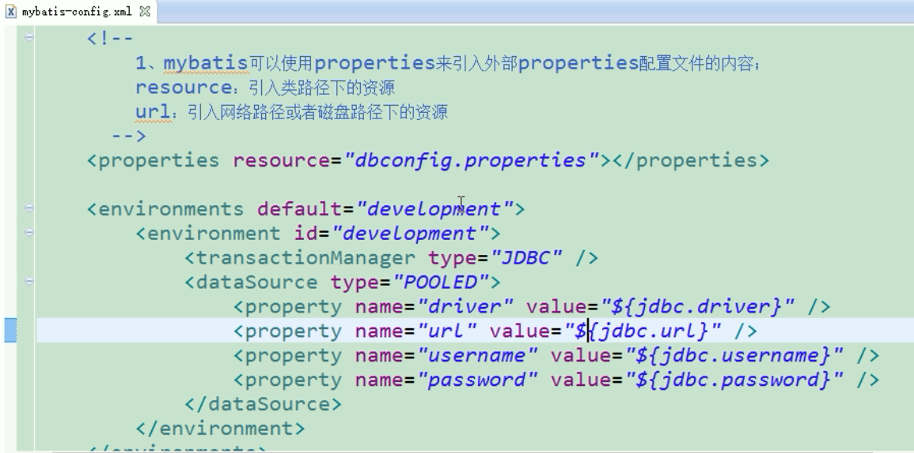
如果属性在不只一个地方进行了配置，那么 MyBatis 将按照下面的顺序来加载：
- 在 properties 元素体内指定的属性首先被读取。
- 然后根据 properties 元素中的 resource 属性读取类路径下属性文件或根据 url 属性指定的路径读取属性文件，并覆盖已读取的同名属性。
- 最后读取作为方法参数传递的属性，并覆盖已读取的同名属性。


## 2.2 settings设置
这是 MyBatis 中极为重要的调整设置，它们会改变 MyBatis 的运行时行为。
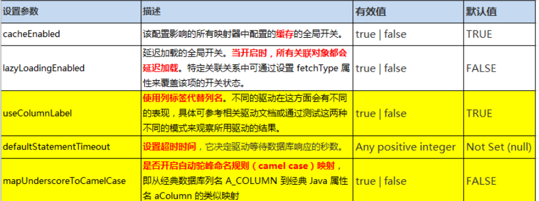

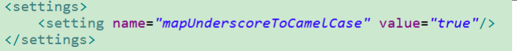

## 2.3 typeAliases 类型命名
类型别名是为 Java 类型设置一个短的名字，可以方便我们引用某个类。

```
		<!-- 1、typeAlias:为某个java类型起别名
				type:指定要起别名的类型全类名;默认别名就是类名小写；employee
				alias:指定新的别名
		 -->
		<!-- <typeAlias type="com.example.mybatis.bean.Employee" alias="emp"/> -->
```
类很多的情况下，可以批量设置别名这个包下的每一个类创建一个默认的别名，就是简单类名小写。

```
		<!-- 2、package:为某个包下的所有类批量起别名 
				name：指定包名（为当前包以及下面所有的后代包的每一个类都起一个默认别名（类名小写），）
		-->
		<package name="com.example.mybatis.bean"/>
```
也可以使用@Alias注解为其指定一个别名
```
@Alias("emp")
public class Employee {
...
```
值得注意的是，MyBatis已经为许多常见的Java类型内建了相应的类型别名。它们都是大小写不敏感的，我们在起别名的时候千万不要占用已有的别名。
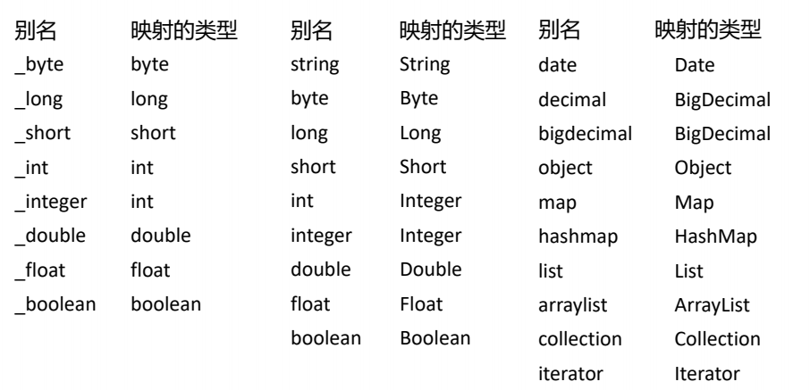

## 2.4 typeHandlers类型处理器
无论是 MyBatis 在预处理语句（PreparedStatement）中设置一个参数时，还是从结果集中取出一个值时， 都会==用类型处理器将获取的值以合适的方式转换成 Java 类型==。
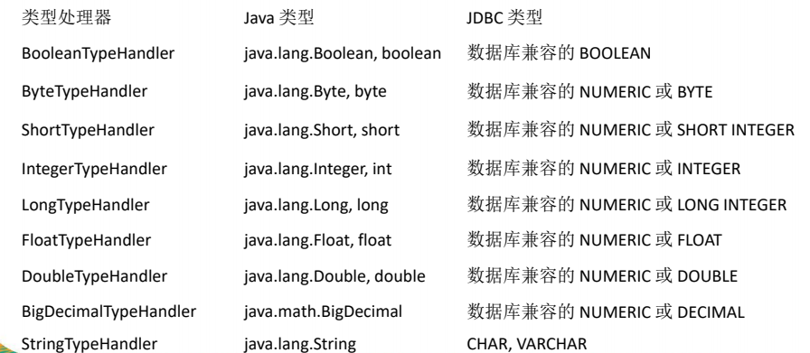

## 2.5 日期类型的处理
- 日期和时间的处理，JDK1.8以前一直是个头疼的问题。我们通常使用JSR310规范领导者Stephen Colebourne创建的Joda-Time来操作。1.8已经实现全部的JSR310规范了。
- 日期时间处理上，我们可以使用MyBatis基于JSR310（Date and Time API）编写的各种日期时间类型处理器。
- MyBatis3.4以前的版本需要我们手动注册这些处理器，以后的版本都是自动注册的。
  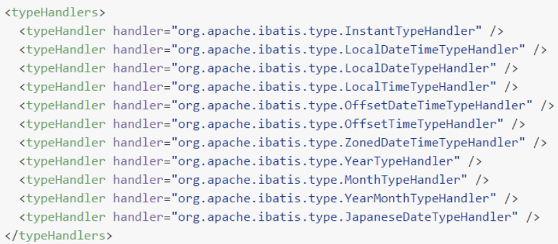

## 2.6 自定义类型处理器
我们可以重写类型处理器或创建自己的类型处理器来处理不支持的或非标准的类型。

**步骤：**
? 1）、实现org.apache.ibatis.type.TypeHandler接口或者继承org.apache.ibatis.type.BaseTypeHandler
? 2）、指定其映射某个JDBC类型（可选操作）
? 3）、在mybatis全局配置文件中注册

## 2.7 plugins插件
插件是MyBatis提供的一个非常强大的机制，我们可以通过插件来修改MyBatis的一些核心行为。==插件通过动态代理机制==，可以介入四大对象的任何一个方法的执行。后面会有专门的章节我们来介绍mybatis运行原理以及插件.

- Executor (update, query, flushStatements, commit, rollback,
  getTransaction, close, isClosed)
- ParameterHandler (getParameterObject, setParameters)
- ResultSetHandler (handleResultSets, handleOutputParameters)
- StatementHandler (prepare, parameterize, batch, update, query)

## 2.8 environments环境
MyBatis可以配置多种环境，比如开发、测试和生产环境需要有不同的配置。

每种环境使用一个environment标签进行配置并指定唯一标识符

可以通过environments标签中的default属性指定一个环境的标识符来快速的切换环境

### 2.8.1 environment-指定具体环境
? id：指定当前环境的唯一标识
? transactionManager、和dataSource都必须有
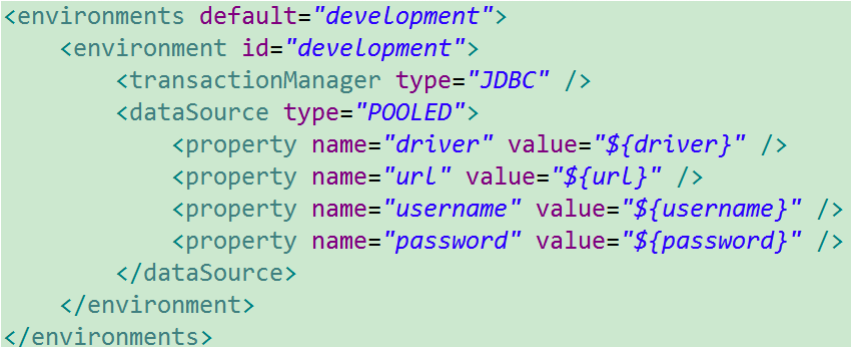

#### 2.8.1.1 transactionManager
type： JDBC | MANAGED | 自定义
- JDBC：使用了 JDBC 的提交和回滚设置，依赖于从数据源得到的连接来管理事务范围。
  JdbcTransactionFactory
- MANAGED：不提交或回滚一个连接、让容器来管理事务的整个生命周期（比如 JEE 应用服务器的上下文）。 ManagedTransactionFactory
- 自定义：实现TransactionFactory接口，type=全类名/别名

#### 2.8.1.2 dataSource
type： UNPOOLED | POOLED | JNDI | 自定义
- UNPOOLED：不使用连接池，UnpooledDataSourceFactory
- POOLED：使用连接池， PooledDataSourceFactory
- JNDI： 在EJB 或应用服务器这类容器中查找指定的数据源
- 自定义：实现DataSourceFactory接口，定义数据源的获取方式。

==实际开发中我们使用Spring管理数据源，并进行事务控制的配置来覆盖上述配置==

## 2.9 databaseIdProvider环境
MyBatis 可以根据不同的数据库厂商执行不同的语句。
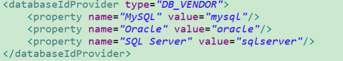

- Type： DB_VENDOR
  - 使用MyBatis提供的VendorDatabaseIdProvider解析数据库厂商标识。也可以实现DatabaseIdProvider接口来自定义。
- Property-name：数据库厂商标识
- Property-value：为标识起一个别名，方便SQL语句使用databaseId属性引用
  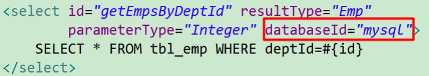

DB_VENDOR
- 会通过 DatabaseMetaData#getDatabaseProductName()返回的字符串进行设置。由于通常情况下这个字符串都非常长而且相同产品的不同版本会返回不同的值，所以最好通过设置属性别名来使其变短。

**MyBatis匹配规则如下：**
- 1、如果没有配置databaseIdProvider标签，那么databaseId=null
- 2、如果配置了databaseIdProvider标签，使用标签配置的name去匹配数据库信息，匹配上设置databaseId=配置指定的值，否则依旧为null
- 3、如果databaseId不为null，他只会找到配置databaseId的sql语句
- 4、MyBatis 会加载不带 databaseId 属性和带有匹配当前数据库databaseId 属性的所有语句。如果同时找到带有databaseId和不带databaseId的相同语句，则后者会被舍弃。


## 2.10 mapper映射
**mapper逐个注册SQL映射文件**
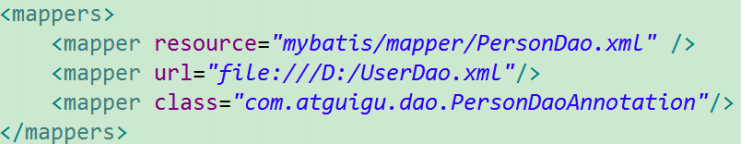

**或者使用批量注册：**
? 这种方式要求SQL映射文件名必须和接口名相同并且在同一目录下


# 四、MyBatis-映射文件
映射文件指导着MyBatis如何进行数据库增删改查，有着非常重要的意义；

- cache �C命名空间的二级缓存配置
- cache-ref �C 其他命名空间缓存配置的引用。
- resultMap �C 自定义结果集映射
- parameterMap �C 已废弃！老式风格的参数映射
- sql �C抽取可重用语句块。
- insert �C 映射插入语句
- update �C 映射更新语句
- delete �C 映射删除语句
- select �C 映射查询语句

## 4.1 insert、update、delete元素


## 4.2 主键生成方式
若数据库支持自动生成主键的字段（比如 MySQL 和 SQL Server），则可以设置
useGeneratedKeys=”true”，然后再把keyProperty 设置到目标属性上。
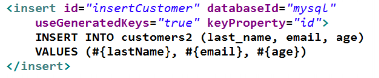

而对于不支持自增型主键的数据库（例如Oracle），则可以使用 selectKey 子元素：
selectKey 元素将会首先运行，id 会被设置，然后插入语句会被调用。
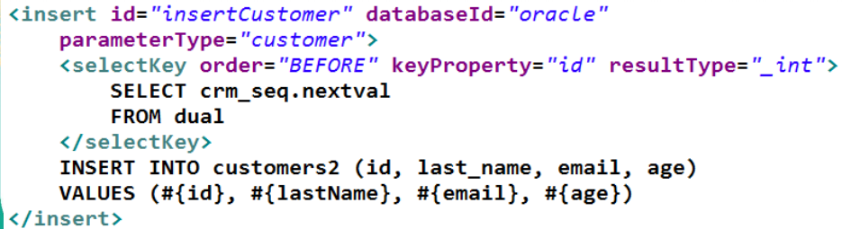

### selectKey
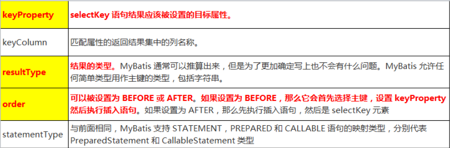

## 4.3 参数（Parameters）传递
- 单个参数
  - 可以接受基本类型，对象类型，集合类型的值。这种情况MyBatis可直接使用这个参数，不需要经过任何处理。
- 多个参数
  - 任意多个参数，都会被MyBatis重新包装成一个Map传入。
    Map的key是param1，param2，0，1…，值就是参数的值。
- 命名参数
  - 为参数使用@Param起一个名字，MyBatis就会将这些参数封装进map中，key就是我们自己指定的名字
- POJO
  - 当这些参数属于我们业务POJO时，我们直接传递POJO
- Map
  - 我们也可以封装多个参数为map，直接传递

### 4.3.1 参数处理
**(1)参数也可以指定一个特殊的数据类型：**
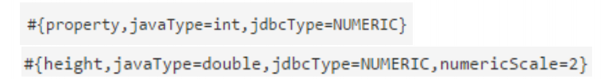
- javaType 通常可以从参数对象中来去确定
- 如果 null 被当作值来传递，对于所有可能为空的列，
  jdbcType 需要被设置
- 对于数值类型，还可以设置小数点后保留的位数：
- mode 属性允许指定 IN，OUT或INOUT参数。如果参数为OUT或INOUT，参数对象属性的真实值将会被改变，就像在获取输出参数时所期望的那样。

**(2)参数位置支持的属性**
�C javaType、jdbcType、mode、numericScale、resultMap、typeHandler、jdbcTypeName、expression

实际上通常被设置的是：
可能为空的列名指定 jdbcType
? #{key}：获取参数的值，预编译到SQL中。安全。
? ${key}：获取参数的值，拼接到SQL中。有SQL注入问题。ORDER BY ${name}

### 4.3.2 select元素
Select元素来定义查询操作。

? Id：唯一标识符。
�C 用来引用这条语句，需要和接口的方法名一致
? parameterType：参数类型。
�C 可以不传，MyBatis会根据TypeHandler自动推断
? resultType：返回值类型。
�C 别名或者全类名，如果返回的是集合，定义集合中元素的类型。不能和resultMap同时使用

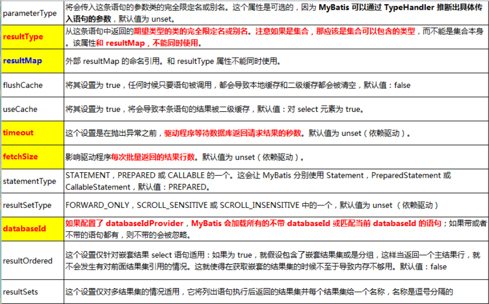

### 4.3.3 自动映射
#### 1、全局setting设置
�C autoMappingBehavior默认是PARTIAL，开启自动映射的功能。唯一的要求是列名和javaBean属性名一致
�C 如果autoMappingBehavior设置为null则会取消自动映射
�C 数据库字段命名规范，POJO属性符合驼峰命名法，如A_COLUMN?aColumn，我们可以开启自动驼峰命名规则映射功能，mapUnderscoreToCamelCase=true。

#### 2、自定义resultMap，实现高级结果集映射。

#### resultMap
? constructor - 类在实例化时, 用来注入结果到构造方法中
�C idArg - ID 参数; 标记结果作为 ID 可以帮助提高整体效能
�C arg - 注入到构造方法的一个普通结果
? id �C 一个 ID 结果; 标记结果作为 ID 可以帮助提高整体效能
? result �C 注入到字段或 JavaBean 属性的普通结果
? association �C 一个复杂的类型关联;许多结果将包成这种类型
�C 嵌入结果映射 �C 结果映射自身的关联,或者参考一个
? collection �C 复杂类型的集
�C 嵌入结果映射 �C 结果映射自身的集,或者参考一个
? discriminator �C 使用结果值来决定使用哪个结果映射
�C case �C 基于某些值的结果映射
? 嵌入结果映射 �C 这种情形结果也映射它本身,因此可以包含很多相同的元
素,或者它可以参照一个外部的结果映射。

##### id & result
? id 和 result 映射一个单独列的值到简单数据类型
(字符串,整型,双精度浮点数,日期等)的属性或字段。
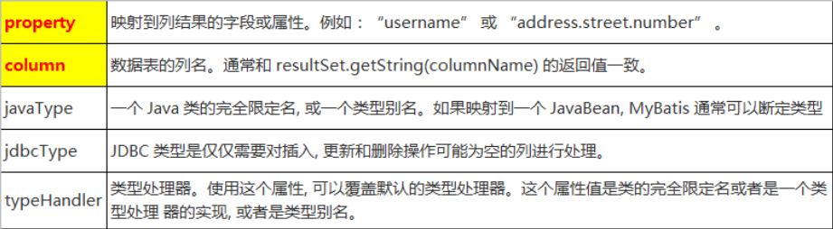

##### association
? 复杂对象映射
? POJO中的属性可能会是一个对象
? 我们可以使用联合查询，并以级联属性的方式封
装对象。
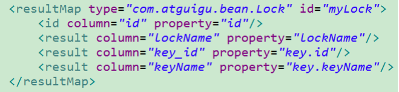
? 使用association标签定义对象的封装规则

##### association-嵌套结果集
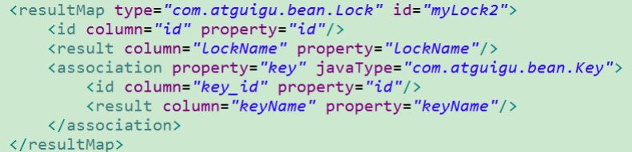


##### association-分段查询
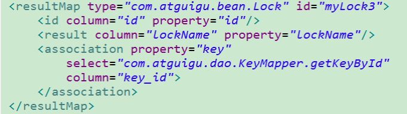
select：调用目标的方法查询当前属性的值
column：将指定列的值传入目标方法

##### association-分段查询&延迟加载
开启延迟加载和属性按需加载
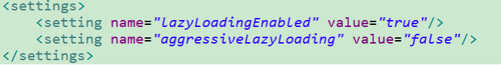
? 旧版本的MyBatis需要额外的支持包
�C asm-3.3.1.jar
�C cglib-2.2.2.jar

##### Collection-集合类型&嵌套结果集
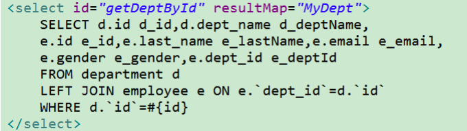


##### Collection-分步查询&延迟加载
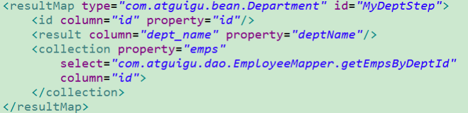

##### 扩展-多列值封装map传递
? 分步查询的时候通过column指定，将对应的列的数据传递过去，我们有时需要传递多列数据。
? 使用{key1=column1,key2=column2…}的形式
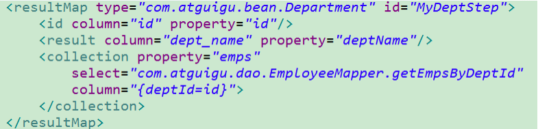
? association或者collection标签的
fetchType=eager/lazy可以覆盖全局的延迟加载策略，+指+定立即加载（eager）或者延迟加载（lazy）


# 五、MyBatis-动态SQL
- 动态 SQL是MyBatis强大特性之一。极大的简化我们拼装SQL的操作。
- 动态 SQL 元素和使用 JSTL 或其他类似基于 XML 的文本处理器相似。
- MyBatis 采用功能强大的基于 OGNL 的表达式来简化操作。
  - if
  - choose (when, otherwise)
  - trim (where, set)
  - foreach

## 5.1 if
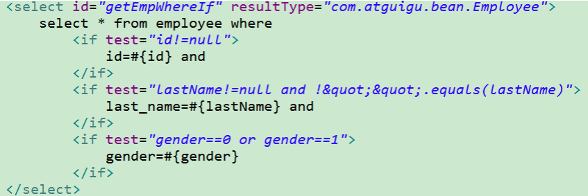

## 5.2 choose (when, otherwise)
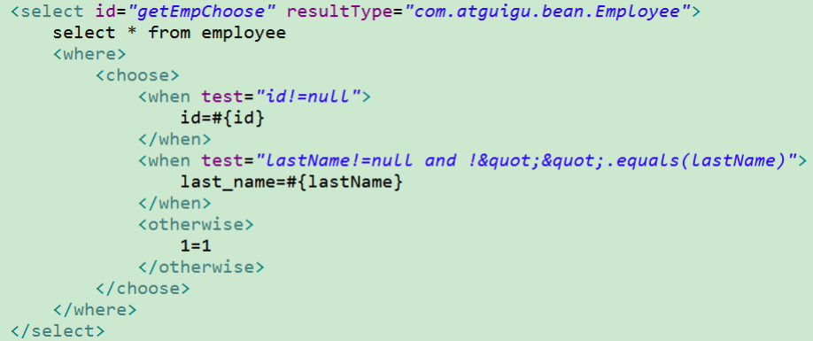

## 5.3 trim (where, set)
### 5.3.1 where
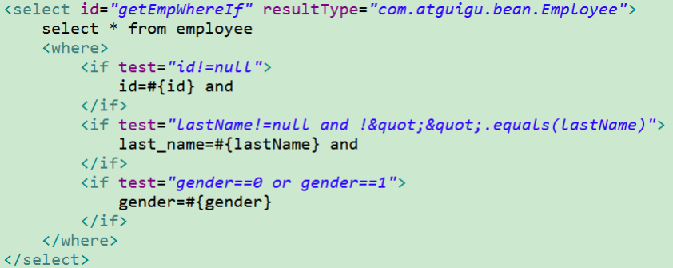

### 5.3.2 set
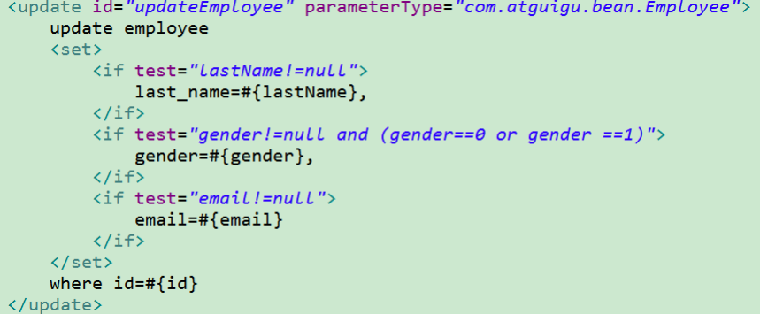

### 5.3.3 trim
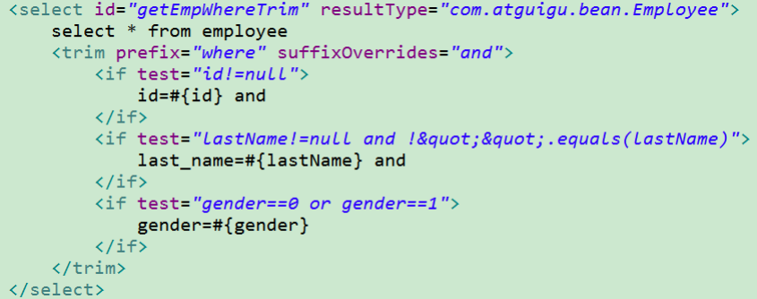

## 5.4 foreach
动态 SQL 的另外一个常用的必要操作是需要对一个集合进行遍历，通常是在构建 IN 条件语句的时候。
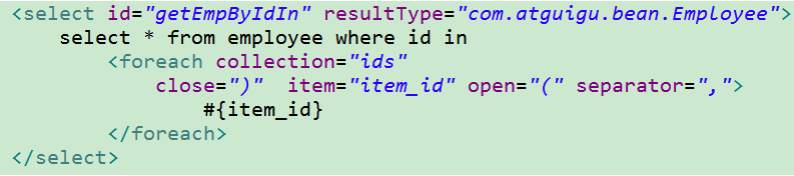
- 当迭代列表、集合等可迭代对象或者数组时
  - index是当前迭代的次数，item的值是本次迭代获取的元素
- 当使用字典（或者Map.Entry对象的集合）时
  - index是键，item是值

## 5.5 bind
bind 元素可以从 OGNL 表达式中创建一个变量并将其绑定到上下文。比如：


## 5.6 Multi-db vendor support
若在 mybatis 配置文件中配置了 databaseIdProvider , 则可以使用 “_databaseId”变量，这样就可以根据不同的数据库厂商构建特定的语句
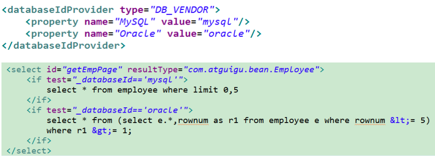

OGNL（ Object Graph Navigation Language）对象图导航语言，这是一种强大的表达式语言，通过它可以非常方便的来操作对象属性。 类似于我们的EL，SpEL等
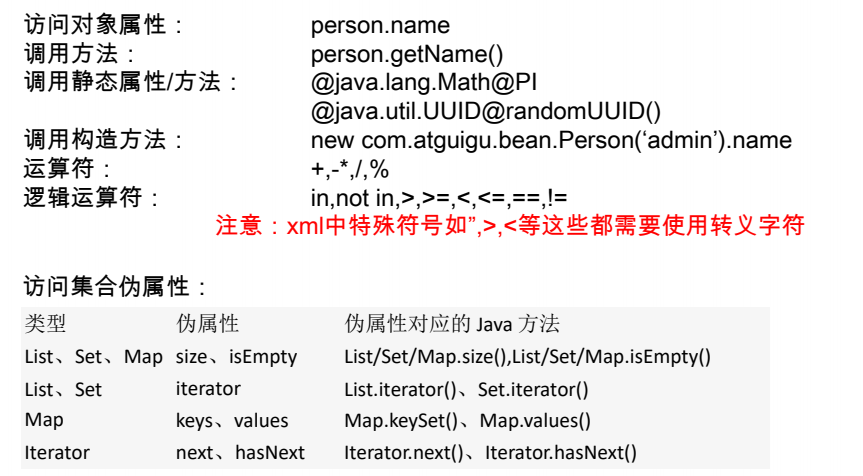


# 六、MyBatis-缓存机制
MyBatis 包含一个非常强大的查询缓存特性,它可以非常方便地配置和定制。缓存可以极大的提升查询效率。

MyBatis系统中默认定义了两级缓存。

一级缓存和二级缓存。
- 1、默认情况下，只有一级缓存（SqlSession级别的缓存，也称为本地缓存）开启。
- 2、二级缓存需要手动开启和配置，他是基于namespace级别的缓存。
- 3、为了提高扩展性。MyBatis定义了缓存接口Cache。我们可以通过实现Cache接口来自定义二级缓存。


## 6.1 一级缓存
一级缓存(local cache), 即本地缓存, 作用域默认为sqlSession。当 Session flush 或 close 后, 该Session 中的所有 Cache 将被清空。

==本地缓存不能被关闭==,但可以调用clearCache()来清空本地缓存,或者改变缓存的作用域.

在mybatis3.1之后, 可以配置本地缓存的作用域. 在 mybatis.xml 中配置
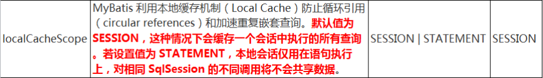

## 6.2 一级缓存演示&失效情况
同一次会话期间只要查询过的数据都会保存在当前SqlSession的一个Map中。
? key:hashCode+查询的SqlId+编写的sql查询语句+参数

一级缓存失效的四种情况：
- 1、不同的SqlSession对应不同的一级缓存
- 2、同一个SqlSession但是查询条件不同
- 3、同一个SqlSession两次查询期间执行了任何一次增删改操作
- 4、同一个SqlSession两次查询期间手动清空了缓存

## 6.3 二级缓存
二级缓存(second level cache)，基于namespace级别缓存，一个namespace对应一个二级缓存。

**工作机制：**
1、一个会话，查询一条数据，这个数据会被放在当前会话的一级缓存中；
2、如果会话关闭；一级缓存中的数据会被保存到二级缓存中；新的会话查询信息会参照二级缓存中的内容。
3、SqlSession===EmployeeMapper ===>Employee  (namespace相当于XXXMapper)
DepartmentMapper===>Department
不同namespace查询出的数据会放在自己对应的缓存中(map中)


二级缓存默认不开启，需要手动配置

MyBatis提供二级缓存的接口以及实现，缓存实现要求POJO实现Serializable接口
==二级缓存在 SqlSession 关闭或提交之后才会生效==

**使用步骤**
�C 1、全局配置文件中开启二级缓存
? <setting name="cacheEnabled" value="true"/>
�C 2、需要使用二级缓存的映射文件处使用cache配置缓存
? <cache />
�C 3、注意：POJO需要实现Serializable接口

## 6.4 缓存相关属性
- eviction=“FIFO”：缓存回收策略：
  -  LRU �C 最近最少使用的：移除最长时间不被使用的对象。
  -  FIFO �C 先进先出：按对象进入缓存的顺序来移除它们。
  -  SOFT �C 软引用：移除基于垃圾回收器状态和软引用规则的对象。
  -  WEAK �C 弱引用：更积极地移除基于垃圾收集器状态和弱引用规则的对象。
  -  默认的是 LRU。
- flushInterval：刷新间隔，单位毫秒
  -  默认情况是不设置，也就是没有刷新间隔，缓存仅仅调用语句时刷新
- size：引用数目，正整数
  -  代表缓存最多可以存储多少个对象，太大容易导致内存溢出
- readOnly：只读，true/false
  -  true：只读缓存；会给所有调用者返回缓存对象的相同实例。因此这些对象
     不能被修改。这提供了很重要的性能优势。不安全，速度快
  -  false：读写缓存；会返回缓存对象的拷贝（通过序列化）。这会慢一些，
     但是安全，因此默认是 false。

## 6.5 缓存有关设置
1、全局setting的cacheEnable：
�C 配置二级缓存的开关。一级缓存一直是打开的。

2、select标签的useCache属性：
�C 配置这个select是否使用二级缓存。一级缓存一直是使用的

3、sql标签的flushCache属性：
�C 增删改默认flushCache=true。sql执行以后，会同时清空一级和二级缓存。
查询默认flushCache=false。

4、sqlSession.clearCache()：
�C 只是用来清除一级缓存。

5、当在某一个作用域 (一级缓存Session/二级缓存
Namespaces) 进行了 C/U/D 操作后，默认该作用域下所有 select 中的缓存将被clear。


# 七、MyBatis-Spring整合
1、查看不同MyBatis版本整合Spring时使用的适配包；
http://www.mybatis.org/spring/

2、下载整合适配包
https://github.com/mybatis/spring/releases

3、官方整合示例，jpetstore
https://github.com/mybatis/jpetstore-6

整合关键配置：
```
<bean id="sqlSessionFactory" class="org.mybatis.spring.SqlSessionFactoryBean">
<!-- 指定mybatis全局配置文件位置 -->
<property name="configLocation" value="classpath:mybatis/mybatis-config.xml"></property>
<!--指定数据源 -->
<property name="dataSource" ref="dataSource"></property>
<!--mapperLocations：所有sql映射文件所在的位置 -->
<property name="mapperLocations" value="classpath:mybatis/mapper/*.xml"></property>
<!--typeAliasesPackage：批量别名处理-->
<property name="typeAliasesPackage" value="com.atguigu.bean"></property>
</bean>
<!--自动的扫描所有的mapper的实现并加入到ioc容器中 -->
<bean id="configure" class="org.mybatis.spring.mapper.MapperScannerConfigurer">
<!�C basePackage:指定包下所有的mapper接口实现自动扫描并加入到ioc容器中 -->
<property name="basePackage" value="com.atguigu.dao"></property>
</bean>

```


# 八、MyBatis-逆向工程
MyBatis Generator：

? 简称MBG，是一个专门为MyBatis框架使用者定制的代码生成器，可以快速的根据表生成对应的映射文件，接口，以及bean类。支持基本的增删改查，以及QBC风格的条件查询。但是表连接、存储过程等这些复杂sql的定义需要我们手工编写

? 官方文档地址
http://www.mybatis.org/generator/

? 官方工程地址
https://github.com/mybatis/generator/releases

## 8.1 MBG使用
使用步骤：
�C 1）编写MBG的配置文件（重要几处配置）
1）jdbcConnection配置数据库连接信息
2）javaModelGenerator配置javaBean的生成策略
3）sqlMapGenerator 配置sql映射文件生成策略
4）javaClientGenerator配置Mapper接口的生成策略
5）table 配置要逆向解析的数据表
tableName：表名
domainObjectName：对应的javaBean名
�C 2）运行代码生成器生成代码

注意：
Context标签
targetRuntime=“MyBatis3“可以生成带条件的增删改查
targetRuntime=“MyBatis3Simple“可以生成基本的增删改查
如果再次生成，建议将之前生成的数据删除，避免xml向后追加内容出现的问
题。

## 8.2 MBG配置文件

```
<generatorConfiguration>
<context id="DB2Tables" targetRuntime="MyBatis3">
//数据库连接信息配置
<jdbcConnection driverClass="com.mysql.jdbc.Driver"
connectionURL="jdbc:mysql://localhost:3306/bookstore0629"
userId="root" password="123456">
</jdbcConnection>
//javaBean的生成策略
<javaModelGenerator targetPackage="com.atguigu.bean" targetProject=".\src">
<property name="enableSubPackages" value="true" />
<property name="trimStrings" value="true" />
</javaModelGenerator>
//映射文件的生成策略
<sqlMapGenerator targetPackage="mybatis.mapper" targetProject=".\conf">
<property name="enableSubPackages" value="true" />
</sqlMapGenerator>
//dao接口java文件的生成策略
<javaClientGenerator type="XMLMAPPER" targetPackage="com.atguigu.dao" 
targetProject=".\src">
<property name="enableSubPackages" value="true" />
</javaClientGenerator>
//数据表与javaBean的映射
<table tableName="books" domainObjectName="Book"></table>
</context>
</generatorConfiguration>

```


# 九、MyBatis-工作原理
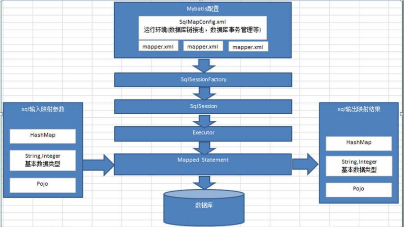

# 十、MyBatis-插件开发

