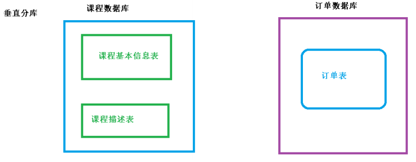

# 一、介绍
## 1.基本概念
### 1.1 什么是ShardingSphere?
- 开源的==分布式的==数据库中间件解决方案
- 有三个产品：Sharding-JDBC、Sharding-Proxy、Sharding-Sidecar(ToDo)
- 定位为==关系型数据库中间件==，合理在分布式环境下使用关系型数据库操作

附：
- 官网地址：https://shardingsphere.apache.org/
- 官网开发手册：https://shardingsphere.apache.org/document/legacy/3.x/document/cn/overview/
- 本文档demo代码地址: https://github.com/zredMonkey/shardingSphere-JDBC-Demo


### 1.2 分库分表
### 1.2.1 是什么？
1、数据库数据量不可控的，随着时间和业务发展，造成表里面数据越来越多，如果再去对数据库表 curd 操作时候，造成性能问题。

2、方案 1：从硬件上

3、方案 2：分库分表。为了解决由于数据量过大而造成数据库性能降低问题。

### 1.2.2 分库分表的方式
1、分库分表有两种方式：垂直切分和水平切分

2、垂直切分：垂直分表和垂直分库

3、水平切分：水平分表和水平分库

#### 1.2.2.1 垂直分表
（1）操作数据库中某张表，把这张表中一部分字段数据存到一张新表里面，再把这张表另一部分字段数据存到另外一张表里面。

**好处：**
如果此时只查询课程基本信息，就只用查询课程基本表即可。
如果改描述信息，不会锁对应的基本信息。


#### 1.2.2.2 垂直分库
（1）把单一数据库按照业务进行划分，专库专表。

原来：

拆分后:

**好处：**
减少数据库IO的压力。

#### 1.2.2.3 水平分库


**好处：**
减少单库单表的数据量。

#### 1.2.2.4 水平分表


# 二、 Sharding-JDBC 分库分表操作
## 2.1 介绍
定位为轻量级Java框架，在Java的JDBC层提供的额外服务。 它使用客户端直连数据库，以jar包形式提供服务，无需额外部署和依赖，可理解为增强版的JDBC驱动，完全兼容JDBC和各种ORM框架。

- 适用于任何基于Java的ORM框架，如：JPA, Hibernate, Mybatis, Spring JDBC Template或直接使用JDBC。
- 基于任何第三方的数据库连接池，如：DBCP, C3P0, BoneCP, Druid, HikariCP等。
- 支持任意实现JDBC规范的数据库。目前支持MySQL，Oracle，SQLServer和PostgreSQL。

Sharding-JDBC 不是做分库分表。

主要做两个功能：数据分片和读写分离。

我们只需要引入相关jar包即可。

主要目的：简化对分库分表之后数据相关操作。

## 2.2 Sharding-JDBC 实现水平分表
### 2.2.1 创建数据库 course_db
### 2.2.2 在数据库创建两张表 course_1 和 course_2


### 2.2.3 约定规则：如果添加课程 id 是偶数把数据添加 course_1，如果奇数添加到 course_2

### 2.2.4 在项目 application.properties 配置文件中进行配置
```
# shardingjdbc 分片策略
# 配置数据源，给数据源起名称
spring.shardingsphere.datasource.names=m1 
 
# 一个实体类对应两张表，覆盖 
spring.main.allow-bean-definition-overriding=true 
 
#配置数据源具体内容，包含连接池，驱动，地址，用户名和密码
spring.shardingsphere.datasource.m1.type=com.alibaba.druid.pool.DruidDataSourc
e 
spring.shardingsphere.datasource.m1.driver-class-name=com.mysql.cj.jdbc.Driver 
spring.shardingsphere.datasource.m1.url=jdbc:mysql://localhost:3306/course_db?
serverTimezone=GMT%2B8 
spring.shardingsphere.datasource.m1.username=root 
spring.shardingsphere.datasource.m1.password=root 
 
#指定 course 表分布情况，配置表在哪个数据库里面，表名称都是什么 m1.course_1 , 
m1.course_2
spring.shardingsphere.sharding.tables.course.actual-data-nodes=m1.course_$-
>{1..2} 
 
# 指定 course 表里面主键 cid 生成策略 SNOWFLAKE
spring.shardingsphere.sharding.tables.course.key-generator.column=cid 
spring.shardingsphere.sharding.tables.course.key-generator.type=SNOWFLAKE 
 
# 指定分片策略 约定 cid 值偶数添加到 course_1 表，如果 cid 是奇数添加到 course_2
表
spring.shardingsphere.sharding.tables.course.table-strategy.inline.sharding￾column=cid 
spring.shardingsphere.sharding.tables.course.table-strategy.inline.algorithm￾expression=course_$->{cid % 2 + 1} 
 
# 打开 sql 输出日志
spring.shardingsphere.props.sql.show=true
```

## 2.3 Sharding-JDBC 实现水平分库

### 2.3.1 创建两个数据库


### 2.3.2 创建数据库和表


### 2.3.3 在 SpringBoot 配置文件配置数据库分片规则
```
# shardingjdbc 分片策略
# 配置数据源，给数据源起名称,
# 水平分库，配置两个数据源
spring.shardingsphere.datasource.names=m1,m2 
 
# 一个实体类对应两张表，覆盖
spring.main.allow-bean-definition-overriding=true 
 
#配置第一个数据源具体内容，包含连接池，驱动，地址，用户名和密码
spring.shardingsphere.datasource.m1.type=com.alibaba.druid.pool.DruidDataSourc
e 
spring.shardingsphere.datasource.m1.driver-class-name=com.mysql.cj.jdbc.Driver 
spring.shardingsphere.datasource.m1.url=jdbc:mysql://localhost:3306/edu_db_1?s
erverTimezone=GMT%2B8 
spring.shardingsphere.datasource.m1.username=root 
spring.shardingsphere.datasource.m1.password=root 
 
#配置第二个数据源具体内容，包含连接池，驱动，地址，用户名和密码
spring.shardingsphere.datasource.m2.type=com.alibaba.druid.pool.DruidDataSourc
e 
spring.shardingsphere.datasource.m2.driver-class-name=com.mysql.cj.jdbc.Driver 
spring.shardingsphere.datasource.m2.url=jdbc:mysql://localhost:3306/edu_db_2?s
erverTimezone=GMT%2B8 
spring.shardingsphere.datasource.m2.username=root 
spring.shardingsphere.datasource.m2.password=root 
 
#指定数据库分布情况，数据库里面表分布情况
# m1 m2 course_1 course_2
spring.shardingsphere.sharding.tables.course.actual-data-nodes=m$-
>{1..2}.course_$->{1..2} 
 
# 指定 course 表里面主键 cid 生成策略 SNOWFLAKE
spring.shardingsphere.sharding.tables.course.key-generator.column=cid 
spring.shardingsphere.sharding.tables.course.key-generator.type=SNOWFLAKE 
 
# 指定表分片策略 约定 cid 值偶数添加到 course_1 表，如果 cid 是奇数添加到
course_2 表
spring.shardingsphere.sharding.tables.course.table-strategy.inline.sharding￾column=cid 
spring.shardingsphere.sharding.tables.course.table-strategy.inline.algorithm￾expression=course_$->{cid % 2 + 1} 
 
# 指定数据库分片策略 约定 user_id 是偶数添加 m1，是奇数添加 m2
#spring.shardingsphere.sharding.default-database-strategy.inline.sharding￾column=user_id
#spring.shardingsphere.sharding.default-database-strategy.inline.algorithm￾expression=m$->{user_id % 2 + 1}
spring.shardingsphere.sharding.tables.course.database￾strategy.inline..sharding-column=user_id 
spring.shardingsphere.sharding.tables.course.database￾strategy.inline.algorithm-expression=m$->{user_id % 2 + 1} 
 
# 打开 sql 输出日志
spring.shardingsphere.props.sql.show=true
```

## 2.4 Sharding-JDBC 实现垂直分库
### 2.4.1 需求分析


### 2.4.2 创建数据库和表


### 2.4.3 在 application.properties 进行配置
```
# shardingjdbc 分片策略
# 配置数据源，给数据源起名称,
# 水平分库，配置两个数据源
spring.shardingsphere.datasource.names=m1,m2,m0 
 
# 一个实体类对应两张表，覆盖
spring.main.allow-bean-definition-overriding=true 
 
#配置第一个数据源具体内容，包含连接池，驱动，地址，用户名和密码
spring.shardingsphere.datasource.m1.type=com.alibaba.druid.pool.DruidDataSourc
e 
spring.shardingsphere.datasource.m1.driver-class-name=com.mysql.cj.jdbc.Driver 
spring.shardingsphere.datasource.m1.url=jdbc:mysql://localhost:3306/edu_db_1?s
erverTimezone=GMT%2B8 
spring.shardingsphere.datasource.m1.username=root 
spring.shardingsphere.datasource.m1.password=root 
 
#配置第二个数据源具体内容，包含连接池，驱动，地址，用户名和密码
spring.shardingsphere.datasource.m2.type=com.alibaba.druid.pool.DruidDataSourc
e 
spring.shardingsphere.datasource.m2.driver-class-name=com.mysql.cj.jdbc.Driver 
spring.shardingsphere.datasource.m2.url=jdbc:mysql://localhost:3306/edu_db_2?s
erverTimezone=GMT%2B8 
spring.shardingsphere.datasource.m2.username=root 
spring.shardingsphere.datasource.m2.password=root 
 
#配置第三个数据源具体内容，包含连接池，驱动，地址，用户名和密码
spring.shardingsphere.datasource.m0.type=com.alibaba.druid.pool.DruidDataSourc
e 
spring.shardingsphere.datasource.m0.driver-class-name=com.mysql.cj.jdbc.Driver 
spring.shardingsphere.datasource.m0.url=jdbc:mysql://localhost:3306/user_db?se
rverTimezone=GMT%2B8 
spring.shardingsphere.datasource.m0.username=root 
spring.shardingsphere.datasource.m0.password=root 
 
# 配置 user_db 数据库里面 t_user 专库专表
spring.shardingsphere.sharding.tables.t_user.actual-data-nodes=m$->{0}.t_user 
 
# 指定 course 表里面主键 cid 生成策略 SNOWFLAKE
spring.shardingsphere.sharding.tables.t_user.key-generator.column=user_id 
spring.shardingsphere.sharding.tables.t_user.key-generator.type=SNOWFLAKE 
 
# 指定表分片策略 约定 cid 值偶数添加到 course_1 表，如果 cid 是奇数添加到
course_2 表
spring.shardingsphere.sharding.tables.t_user.table-strategy.inline.sharding￾column=user_id 
spring.shardingsphere.sharding.tables.t_user.table-strategy.inline.algorithm￾expression=t_user
```

## 2.5 Sharding-JDBC 操作公共表
### 2.5.1 公共表
- 存储固定数据的表，表数据很少发生变化，查询时候经常进行关联
- 在每个数据库中创建出相同结构公共表
  


### 2.5.2 在多个数据库都创建相同结构公共表


### 2.5.3 在项目配置文件 application.properties 进行公共表配置
```
# 配置公共表
spring.shardingsphere.sharding.broadcast-tables=t_udict 
spring.shardingsphere.sharding.tables.t_udict.key-generator.column=dictid 
spring.shardingsphere.sharding.tables.t_udict.key-generator.type=SNOWFLAKE
```

## 2.6 Sharding-JDBC 实现读写分离
### 2.6.1 读写分离概念
为了确保数据库产品的稳定性，很多数据库拥有双机热备功能。也就是，第一台数据库服务器，是对外提供增删改业务的生产服务器；第二台数据库服务器，主要进行读的操作。
原理：让主数据库(master)进行事务性增、改、删操作，而从数据库(slave)处理SELECT查询操作。


读写原理：


==**Sharding-JDBC 通过 sql 语句语义分析，实现读写分离过程，不会做数据同步(mysql做)**==


### 2.6.2 Mysql配置读写分离
#### 第一步 创建两个 MySQL 数据库服务，并且启动两个 MySQL 服务

#### 第二步 配置 MySQL 主从服务器
##### （1）在主服务器配置文件
```
[mysqld]
#开启日志
log‐bin = mysql‐bin
#设置服务id，主从不能一致
server‐id = 1
#设置需要同步的数据库
binlog‐do‐db=user_db
#屏蔽系统库同步
binlog‐ignore‐db=mysql
binlog‐ignore‐db=information_schema
binlog‐ignore‐db=performance_schema
```

##### （2）在从服务器配置文件
```
[mysqld]
#开启日志
log‐bin = mysql‐bin
#设置服务id，主从不能一致
server‐id = 2
#设置需要同步的数据库
replicate_wild_do_table=user_db.%
#屏蔽系统库同步
replicate_wild_ignore_table=mysql.%
replicate_wild_ignore_table=information_schema.%
replicate_wild_ignore_table=performance_schema.%
```
##### （3）把主和从服务器重启

#### 第三步 创建用于主从复制的账号
```
#切换至主库bin目录，登录主库
mysql ‐h localhost ‐uroot ‐p
#授权主备复制专用账号
GRANT REPLICATION SLAVE ON *.* TO 'db_sync'@'%' IDENTIFIED BY 'db_sync';
#刷新权限
FLUSH PRIVILEGES;
```

```
#确认位点 记录下文件名以及位点
show master status;
```


#### 第四步 主从数据同步设置
```
#切换至从库bin目录，登录从库
mysql ‐h localhost ‐P3307 ‐uroot ‐p
#先停止同步
STOP SLAVE;
#修改从库指向到主库，使用上一步记录的文件名以及位点
CHANGE MASTER TO
master_host = 'localhost',
master_user = 'db_sync',
master_password = 'db_sync',
master_log_file = 'mysql-bin.000177',
master_log_pos = 107;
#启动同步
START SLAVE;
#查看Slave_IO_Runing和Slave_SQL_Runing字段值都为Yes，表示同步配置成功。如果不为Yes，请排查相关异常。
show slave status
```


### 2.6.3 Sharding-JDBC 操作
#### 2.6.3.1 配置读写分离策略
```
# user_db 从服务器
spring.shardingsphere.datasource.s0.type=com.alibaba.druid.pool.DruidDataSource 
spring.shardingsphere.datasource.s0.driver-class-name=com.mysql.cj.jdbc.Driver 
spring.shardingsphere.datasource.s0.url=jdbc:mysql://localhost:3307/user_db?serverTimezone=GMT%2B8 
spring.shardingsphere.datasource.s0.username=root 
spring.shardingsphere.datasource.s0.password=root 
 
# 主库从库逻辑数据源定义 ds0 为 user_db
spring.shardingsphere.sharding.master-slave-rules.ds0.master-data-source-name=m0 
spring.shardingsphere.sharding.master-slave-rules.ds0.slave-data-source-names=s0 
 
# 配置 user_db 数据库里面 t_user 专库专表
#spring.shardingsphere.sharding.tables.t_user.actual-data-nodes=m$->{0}.t_user

# t_user 分表策略，固定分配至 ds0 的 t_user 真实表
spring.shardingsphere.sharding.tables.t_user.actual-data-nodes=ds0.t_user
```

# 三、 Sharding-Proxy 分库分表操作
## 3.1 介绍
定位为透明化的数据库代理端，提供封装了数据库二进制协议的服务端版本，用于完成对异构语言的支持。 目前先提供MySQL版本，它可以使用任何兼容MySQL协议的访问客户端(如：MySQL Command Client, MySQL Workbench等)操作数据，对DBA更加友好。

- 向应用程序完全透明，可直接当做MySQL使用。
- 适用于任何兼容MySQL协议的客户端。

**定位为透明的数据库代理端**。


Sharding-Proxy 独立应用，需要安装服务，进行分库分表或者读写分离配置，启动 使用。


# 注：
## 1、应用
（1）在数据库设计时候考虑垂直分库和垂直分表。

（2）随着数据库数据量增加，不要马上考虑做水平切分，首先考虑缓存处理，读写分离，使用索引等等方式，如果这些方式不能根本解决问题了，再考虑做水平分库和水平分表。

## 2、分库分表问题
（1）跨节点连接查询问题（分页、排序）


（2）多数据源管理问题