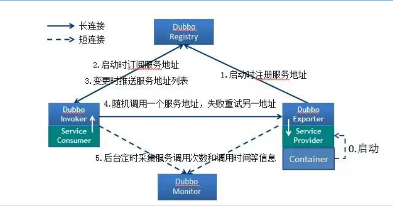
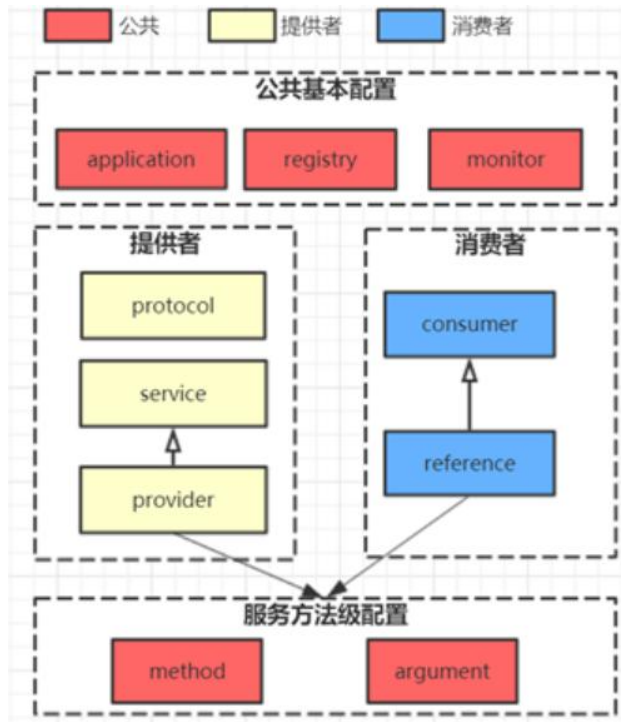
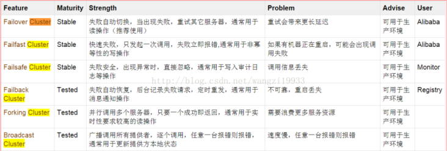
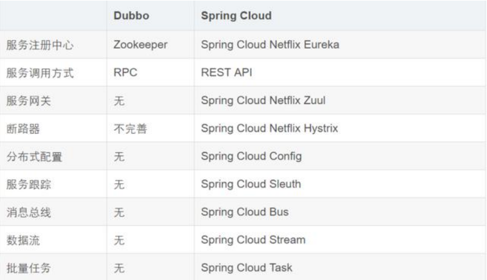

## 1.Dubbo 支持哪些协议，每种协议的应用场景，优缺点？[点我跳转](#dubbo1)
## 2.Dubbo 超时时间怎样设置？[点我跳转](#dubbo2)
## 3.Dubbo 的主要应用场景？[点我跳转](#dubbo3)
## 4.Dubbo 的核心功能？[点我跳转](#dubbo4)
## 5.Dubbo 服务注册与发现的流程？[点我跳转](#dubbo5)
## 6. Dubbo 使用的是什么通信框架?[点我跳转](#dubbo6)
## 7.Dubbo 的集群容错方案有哪些？[点我跳转](#dubbo7)
## 8.Dubbo 支持哪些序列化方式？[点我跳转](#dubbo8)
## 9.服务调用超时问题怎么解决？[点我跳转](#dubbo9)
## 10.Dubbo 在安全机制方面是如何解决？[点我跳转](#dubbo10)
## 11.Dubbo 和 Spring Cloud 的关系？[点我跳转](#dubbo11)
## 12.Dubbo 和 Spring Cloud 的区别？[点我跳转](#dubbo12)
## 13.Dubbo启动时如果依赖的服务不可⽤会怎样？[点我跳转](#dubbo13)
## 14.Dubbo默认使⽤的是什么通信框架，还有别的选择吗？[点我跳转](#dubbo14)
## [15.服务上线怎么兼容旧版本？](#dubbo15)
## [16.Dubbo服务之间的调⽤是阻塞的吗？](#dubbo16)
## [17.说说 Dubbo 服务暴露的过程。](#dubbo17)
## [18.注册中⼼挂了，消费者还能调⽤服务者吗？](#dubbo18)

---

## 1.Dubbo 支持哪些协议，每种协议的应用场景，优缺点？
- dubbo： 单一长连接和 NIO 异步通讯，适合大并发小数据量的服务调用，以及消费者远大于提供者。传输协议 TCP，异步，Hessian 序列化；
- rmi： 采用 JDK 标准的 rmi 协议实现，传输参数和返回参数对象需要实现
Serializable 接口，使用 java 标准序列化机制，使用阻塞式短连接，传输数
据包大小混合，消费者和提供者个数差不多，可传文件，传输协议 TCP。
多个短连接，TCP 协议传输，同步传输，适用常规的远程服务调用和 rmi 互
操作。在依赖低版本的 Common-Collections 包，java 序列化存在安全漏洞；
- webservice： 基于 WebService 的远程调用协议，集成 CXF 实现，提供和
原生 WebService 的互操作。多个短连接，基于HTTP传输，同步传输，适用系统集成和跨语言调用；
- http： 基于 Http 表单提交的远程调用协议，使用 Spring 的 HttpInvoke 实现。多个短连接，传输协议HTTP，传入参数大小混合，提供者个数多于消费者，需要给应用程序和浏览器 JS 调用；
- essian： 集成 Hessian 服务，基于 HTTP 通讯，采用 Servlet 暴露服务，Dubbo 内嵌 Jetty 作为服务器时默认实现，提供与 Hession 服务互操作。多个短连接，同步 HTTP 传输，Hessian 序列化，传入参数较大，提供者大于消费者，提供者压力较大，可传文件；
- memcache： 基于 memcached 实现的 RPC 协议
- redis： 基于 redis 实现的 RPC 协议

## 2.Dubbo 超时时间怎样设置？
Dubbo 超时时间设置有两种方式：
- 服务提供者端设置超时时间，在 Dubbo 的用户文档中，推荐如果能在服务端多配置就尽量多配置，因为服务提供者比消费者更清楚自己提供的服务特性。
- 服务消费者端设置超时时间，如果在消费者端设置了超时时间，以消费者端为主，即优先级更高。因为服务调用方设置超时时间控制性更灵活。如果消费方超时，服务端线程不会定制，会产生警告。

## 3.Dubbo 的主要应用场景？
- 透明化的远程方法调用，就像调用本地方法一样调用远程方法，只需简单配置，没有任何 API 侵入。
- 软负载均衡及容错机制，可在内网替代 F5等硬件负载均衡器，降低成本，减少单点。
- 服务自动注册与发现，不再需要写死服务提供方地址，注册中心基于接口名查询服务提供者的 IP 地址，并且能够平滑添加或删除服务提供者。

## 4.Dubbo 的核心功能？
主要就是如下 3 个核心功能：
- Remoting：网络通信框架，提供对多种 NIO 框架抽象封装，包括
“同步转异步”和“请求-响应”模式的信息交换方式。
- Cluster：服务框架，提供基于接口方法的透明远程过程调用，包括多
协议支持，以及软负载均衡，失败容错，地址路由，动态配置等集群
支持。
- Registry：服务注册，基于注册中心目录服务，使服务消费方能动态
的查找服务提供方，使地址透明，使服务提供方可以平滑增加或减少
机器。

## 5.Dubbo 服务注册与发现的流程？

**流程说明：**
- Provider(提供者)绑定指定端口并启动服务
- 提供者连接注册中心，并将本机 IP、端口、应用信息和提供服务信息
发送至注册中心存储
- Consumer(消费者），连接注册中心 ，并发送应用信息、所求服务信
息至注册中心
- 注册中心根据 消费 者所求服务信息匹配对应的提供者列表发送至
Consumer 应用缓存。
- Consumer 在发起远程调用时基于缓存的消费者列表择其一发起调
用。
- Provider 状态变更会实时通知注册中心、在由注册中心实时推送至
Consumer

**设计的原因：**
- Consumer 与 Provider 解偶，双方都可以横向增减节点数。
- 注册中心对本身可做对等集群，可动态增减节点，并且任意一台宕掉
后，将自动切换到另一台
- 去中心化，双方不直接依懒注册中心，即使注册中心全部宕机短时间
内也不会影响服务的调用
- 服务提供者无状态，任意一台宕掉后，不影响使用

## 6. Dubbo 使用的是什么通信框架?
默认使用 NIO Netty 框架

## 7.Dubbo 的集群容错方案有哪些？

- Failover Cluster(**默认**): 失败自动切换，当出现失败，重试其它服务器。通常用于读操作，但重试会带来更长延迟。
- Failfast Cluster: 快速失败，只发起一次调用，失败立即报错。通常用于非幂等性的写操作，比如新增记录。
- Failsafe Cluster: 失败安全，出现异常时，直接忽略。通常用于写入审计日志等操作。
- Failback Cluster: 失败自动恢复，后台记录失败请求，定时重发。通常用于消息通知操作。
- Forking Cluster: 并行调用多个服务器，只要一个成功即返回。通常用于实时性要求较高的读操作，但需要浪费更多服务资源。可通过 forks="2" 来设置最大并行数。
- Broadcast Cluster: 广播调用所有提供者，逐个调用，任意一台报错则报错 。通常用于通知所有提供者更新缓存或日志等本地资源信息。

## 8.Dubbo 支持哪些序列化方式？
默认使用 Hessian 序列化，还有 Duddo、FastJson、Java 自带序列
化。

## 9.服务调用超时问题怎么解决？
dubbo 在调用服务不成功时，默认是会重试两次的。

## 10.Dubbo 在安全机制方面是如何解决？
Dubbo 通过 Token 令牌防止用户绕过注册中心直连，然后在注册中
心上管理授权。Dubbo 还提供服务黑白名单，来控制服务所允许的调
用方。

## 11.Dubbo 和 Spring Cloud 的关系？
Dubbo 是 SOA 时代的产物，它的关注点主要在于服务的调用，流
量分发、流量监控和熔断。而 Spring Cloud 诞生于微服务架构时
代，考虑的是微服务治理的方方面面，另外由于依托了 Spirng、
Spirng Boot 的优势之上，两个框架在开始目标就不一致，Dubbo
定位服务治理、Spirng Cloud 是一个生态。

## 12.Dubbo 和 Spring Cloud 的区别？

**最大的区别**：Dubbo 底层是使用 Netty 这样的 NIO 框架，是基于
TCP 协议传输的，配合以 Hession 序列化完成 RPC 通信。

而 SpringCloud 是基于 Http 协议+Rest 接口调用远程过程的通信，
相对来说，Http 请求会有更大的报文，占的带宽也会更多。但是
REST 相比 RPC 更为灵活，服务提供方和调用方的依赖只依靠一纸契
约，不存在代码级别的强依赖。

## 13.Dubbo启动时如果依赖的服务不可⽤会怎样？
Dubbo 缺省会在启动时检查依赖的服务是否可⽤，不可⽤时会抛出异常，阻⽌ Spring 初始化完成，默认 check="true"，可
以通过 check="false" 关闭检查。

## 14.Dubbo默认使⽤的是什么通信框架，还有别的选择吗？
Dubbo 默认使⽤ Netty 框架，也是推荐的选择，另外内容还集成有Mina、Grizzly。

## 15.服务上线怎么兼容旧版本？
可以⽤版本号（version）过渡，多个不同版本的服务注册到注册中⼼，版本号不同的服务相互间不引⽤。这个和服务分组的概念有⼀点类似。

## 16.Dubbo服务之间的调⽤是阻塞的吗？
默认是同步等待结果阻塞的，⽀持异步调⽤。
Dubbo 是基于 NIO 的⾮阻塞实现并⾏调⽤，客户端不需要启动多线程即可完成并⾏调⽤多个远程服务，相对多线程开销较
⼩，异步调⽤会返回⼀个 Future 对象。

## 17.说说 Dubbo 服务暴露的过程。
Dubbo 会在 Spring 实例化完 bean 之后，在刷新容器最后⼀步发布 ContextRefreshEvent 事件的时候，通知实现了
ApplicationListener 的 ServiceBean 类进⾏回调 onApplicationEvent 事件⽅法，Dubbo 会在这个⽅法中调⽤ ServiceBean ⽗类
ServiceConfig 的 export ⽅法，⽽该⽅法真正实现了服务的（异步或者⾮异步）发布。

## 18.注册中⼼挂了，消费者还能调⽤服务者吗？
1. 注册中⼼对等集群，任意⼀台宕掉后，会⾃动切换到另⼀台
2. 注册中⼼全部宕掉，服务提供者和消费者仍可以通过本地缓存通讯
3. 服务提供者⽆状态，任⼀台 宕机后，不影响使⽤
4. 服务提供者全部宕机，服务消费者会⽆法使⽤，并⽆限次重连等待服务者恢复

